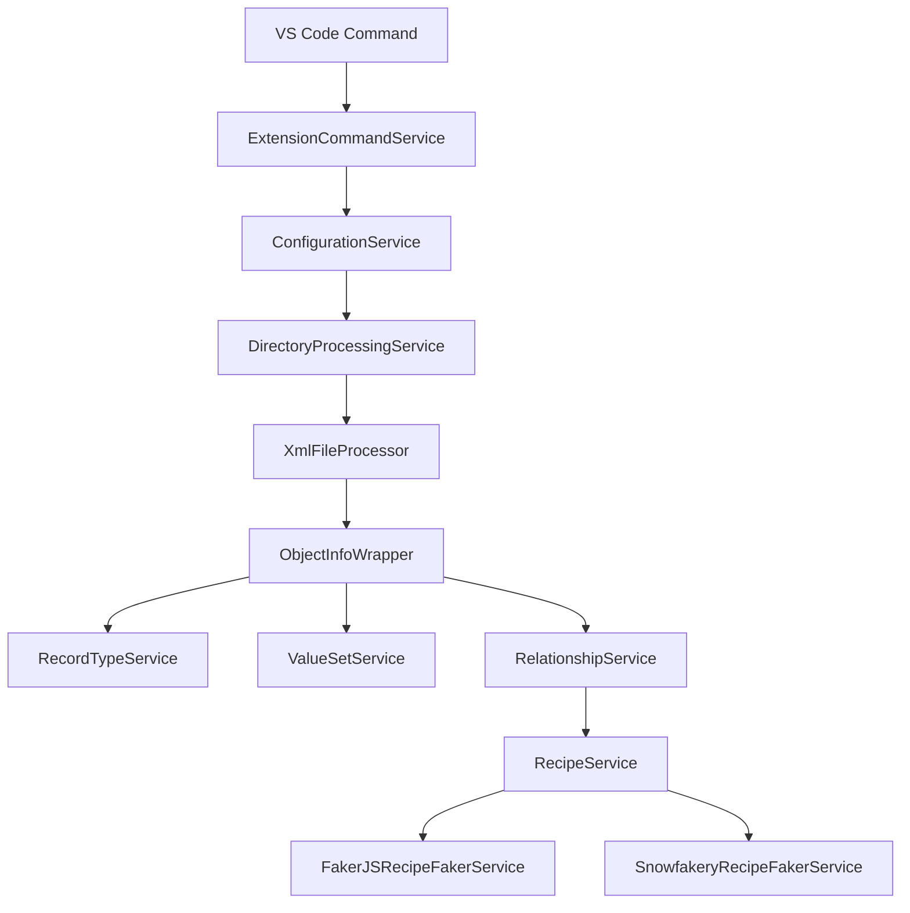

Generate mermaid diagrams for the current PR showing how the recipe generation pipeline was affected by the changes.

---

## Step 1 — Determine Scope

```bash
git diff main...HEAD --name-only
REPO_URL=$(git remote get-url origin | sed 's/\.git$//' | sed 's|git@github.com:|https://github.com/|')
BRANCH=$(git branch --show-current)
```

Read the changed files and understand which services in the recipe generation pipeline were modified.

---

## Diagram 1: Recipe Pipeline — Before / After

### Determine what changed

Map changed files to pipeline stages:

| Changed file pattern | Pipeline stage |
|---|---|
| `extension.ts` | Command Registration |
| `ExtensionCommandService/` | Command Handler |
| `ConfigurationService/` | Configuration |
| `DirectoryProcessingService/` | Directory Walking |
| `XMLProcessingService/` or `XmlFileProcessor` | XML Parsing |
| `ObjectInfoWrapper/` | Metadata Wrapping |
| `RecordTypeService/` | Record Type Detection |
| `ValueSetService/` | Value Set Parsing |
| `RelationshipService/` | Relationship Grouping |
| `RecipeService/` | Recipe Orchestration |
| `FakerJSRecipeFakerService/` | FakerJS Generation |
| `SnowfakeryRecipeFakerService/` | Snowfakery Generation |
| `FakerRecipeProcessor/` | Recipe Processing |

### Generate the Before/After diagram

```markdown
## Code Flow Diagrams

### Before (main branch)



### After (this PR)

*(Same diagram, but highlight the changed stages with a different style and link to the branch versions)*

```mermaid
flowchart TD
    CMD["VS Code Command"] --> ECS["ExtensionCommandService"]
    ...
    %%  changed nodes styled:
    style <ChangedNode> fill:#d4edda,stroke:#28a745
```
```

Adapt the Before/After diagrams to accurately reflect what changed. If a new service was inserted in the pipeline, show it in the After diagram. If a method was changed, note it on the edge or node.

---

## Diagram 2: Changed Files and Their Test Coverage

```markdown
### Changed Files

```mermaid
graph LR
    subgraph Changed["Changed in PR"]
        direction TB
        <ServiceA>["<ServiceA>.ts"]
        <ServiceA_test>["<ServiceA>.test.ts"]
    end

    <ServiceA> -->|"tested by"| <ServiceA_test>

    click <ServiceA> "<REPO_URL>/blob/<BRANCH>/src/treecipe/src/<ServiceA>/<ServiceA>.ts"
    click <ServiceA_test> "<REPO_URL>/blob/<BRANCH>/src/treecipe/src/<ServiceA>/tests/<ServiceA>.test.ts"
```
```

List all changed `.ts` files and their corresponding test files. Flag any changed service without a corresponding test file change.

---

## Step 2 — Post to PR

Check if a PR exists:

```bash
gh pr view --json number,url 2>/dev/null
```

If a PR exists, post the diagrams as a PR comment:

```bash
gh pr comment <number> --body "$(cat <<'EOF'
## 📊 PR Diagrams — Recipe Pipeline Impact

<insert mermaid diagrams here>
EOF
)"
```

Or, if the PR body has placeholder sections for diagrams, update the PR body directly:

```bash
gh pr edit <number> --body "<updated body with diagrams>"
```

---

## Step 3 — Report

```
## PR Diagrams Generated

### Changed Pipeline Stages
<list of stages affected by this PR>

### Diagrams Posted
- Before/After recipe pipeline flow: ✅
- Changed files + test coverage: ✅

### Test Coverage Gaps
PASS — all changed services have updated tests
  OR
WARN — <service>.ts changed but no test file change detected
```

---

## Notes

- Use `style` directives to visually distinguish changed nodes (green `#d4edda` fill)
- Always include `click` directives so reviewers can navigate directly to the changed files on GitHub
- If the PR only touches tests and not service files, generate a simpler "tests updated" diagram instead of a pipeline flow
