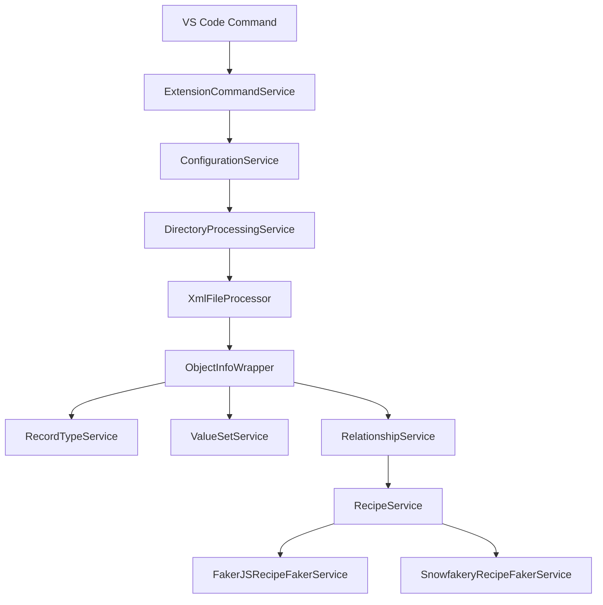

Generate mermaid diagrams for the current PR showing how the recipe generation pipeline was affected by the changes.

---

## Step 1 — Determine Scope

```bash
git diff main...HEAD --name-only
REPO_URL=$(git remote get-url origin | sed 's/\.git$//' | sed 's|git@github.com:|https://github.com/|')
BRANCH=$(git branch --show-current)
```

Read the changed files and understand which services in the recipe generation pipeline were modified.

---

## Diagram 1: Recipe Pipeline — Before / After

### Determine what changed

Map changed files to pipeline stages:

| Changed file pattern | Pipeline stage |
|---|---|
| `extension.ts` | Command Registration |
| `ExtensionCommandService/` | Command Handler |
| `ConfigurationService/` | Configuration |
| `DirectoryProcessingService/` | Directory Walking |
| `XMLProcessingService/` or `XmlFileProcessor` | XML Parsing |
| `ObjectInfoWrapper/` | Metadata Wrapping |
| `RecordTypeService/` | Record Type Detection |
| `ValueSetService/` | Value Set Parsing |
| `RelationshipService/` | Relationship Grouping |
| `RecipeService/` | Recipe Orchestration |
| `FakerJSRecipeFakerService/` | FakerJS Generation |
| `SnowfakeryRecipeFakerService/` | Snowfakery Generation |
| `FakerRecipeProcessor/` | Recipe Processing |

### Generate the Before/After diagram

```markdown
## Code Flow Diagrams

### Before (main branch)


```mermaid
flowchart TD
    CMD["VS Code Command"] --> ECS["ExtensionCommandService"]
    ECS --> CFG["ConfigurationService"]
    CFG --> DPS["DirectoryProcessingService"]
    DPS --> XFP["XmlFileProcessor"]
    XFP --> OIW["ObjectInfoWrapper"]
    OIW --> RTS["RecordTypeService"]
    OIW --> VSS["ValueSetService"]
    OIW --> RS["RelationshipService"]
    RS --> RCS["RecipeService"]
    RCS --> FJS["FakerJSRecipeFakerService"]
    RCS --> SFY["SnowfakeryRecipeFakerService"]

    click ECS "<REPO_URL>/blob/main/src/treecipe/src/ExtensionCommandService/ExtensionCommandService.ts"
    click RCS "<REPO_URL>/blob/main/src/treecipe/src/RecipeService/RecipeService.ts"
    click FJS "<REPO_URL>/blob/main/src/treecipe/src/RecipeFakerService.ts/FakerJSRecipeFakerService/FakerJSRecipeFakerService.ts"
    click SFY "<REPO_URL>/blob/main/src/treecipe/src/RecipeFakerService.ts/SnowfakeryRecipeFakerService/SnowfakeryRecipeFakerService.ts"
```

### After (this PR)

*(Same diagram, but highlight the changed stages with a different style and link to the branch versions)*

```mermaid
flowchart TD
    CMD["VS Code Command"] --> ECS["ExtensionCommandService"]
    ...
    %%  changed nodes styled:
    style <ChangedNode> fill:#d4edda,stroke:#28a745
```
```

Adapt the Before/After diagrams to accurately reflect what changed. If a new service was inserted in the pipeline, show it in the After diagram. If a method was changed, note it on the edge or node.

---

## Diagram 2: Changed Files and Their Test Coverage

```markdown
### Changed Files

```mermaid
graph LR
    subgraph Changed["Changed in PR"]
        direction TB
        <ServiceA>["<ServiceA>.ts"]
        <ServiceA_test>["<ServiceA>.test.ts"]
    end

    <ServiceA> -->|"tested by"| <ServiceA_test>

    click <ServiceA> "<REPO_URL>/blob/<BRANCH>/src/treecipe/src/<ServiceA>/<ServiceA>.ts"
    click <ServiceA_test> "<REPO_URL>/blob/<BRANCH>/src/treecipe/src/<ServiceA>/tests/<ServiceA>.test.ts"
```
```

List all changed `.ts` files and their corresponding test files. Flag any changed service without a corresponding test file change.

---

## Step 1b — Validate every diagram before posting (REQUIRED)

GitHub shows a parse error instead of a diagram when a block is malformed, and this has shipped broken more than once. Render each block locally first; never post an unrendered diagram.

```bash
# One-time setup in a scratch directory (no Chromium download — use the pre-installed one)
mkdir -p "$SCRATCH/mmdc" && cd "$SCRATCH/mmdc" && npm init -y >/dev/null \
  && PUPPETEER_SKIP_DOWNLOAD=1 npm i --ignore-scripts @mermaid-js/mermaid-cli@11.4.2
echo '{"executablePath":"/opt/pw-browsers/chromium-1194/chrome-linux/chrome","args":["--no-sandbox"]}' > "$SCRATCH/pp.json"

# Each diagram in its own .mmd file (the block's contents, without the ``` fences)
"$SCRATCH/mmdc/node_modules/.bin/mmdc" -p "$SCRATCH/pp.json" -i before.mmd -o before.png -b white
```

A `Lexical error` or `Parse error` means the block is broken: fix it and render again. Then look at the PNG. A diagram can parse and still be unreadable, for example a `direction TB` subgraph inside a `graph LR` that renders as one tiny row.

Rules that have broken diagrams before:
- A `click` URL is a plain double-quoted string: `click RS "https://github.com/..."`. **Never** wrap it in backticks (`"``https://...``"`) or angle brackets; either is a lexical error.
- Write labels in plain text. Do not use HTML entities (`&lt;`, `&gt;`, `&amp;`): write `Object_child_NickName`, not `&lt;Object&gt;_child_NickName`. `<br/>` is the only markup allowed.
- Quote every label that contains `(`, `)`, `:`, `,` or `/`: `RS["RelationshipService<br/>(self-lookup)"]`.
- Write the comment body with real line breaks. A body built through a JSON or shell string must not turn the fences into escaped text.

---

## Step 2 — Post to PR

Check if a PR exists:

```bash
gh pr view --json number,url 2>/dev/null
```

If a PR exists, post the diagrams as a PR comment:

```bash
gh pr comment <number> --body "$(cat <<'EOF'
## 📊 PR Diagrams — Recipe Pipeline Impact

<insert mermaid diagrams here>
EOF
)"
```

Or, if the PR body has placeholder sections for diagrams, update the PR body directly:

```bash
gh pr edit <number> --body "<updated body with diagrams>"
```

---

## Step 3 — Report

```
## PR Diagrams Generated

### Changed Pipeline Stages
<list of stages affected by this PR>

### Diagrams Posted
- Before/After recipe pipeline flow: ✅
- Changed files + test coverage: ✅

### Test Coverage Gaps
PASS — all changed services have updated tests
  OR
WARN — <service>.ts changed but no test file change detected
```

---

## Notes

- Use `style` directives to visually distinguish changed nodes (green `#d4edda` fill)
- Always include `click` directives so reviewers can navigate directly to the changed files on GitHub, written as plain quoted URLs (see Step 1b)
- Never post a diagram that has not been rendered with `mmdc` (Step 1b)
- If the PR only touches tests and not service files, generate a simpler "tests updated" diagram instead of a pipeline flow
