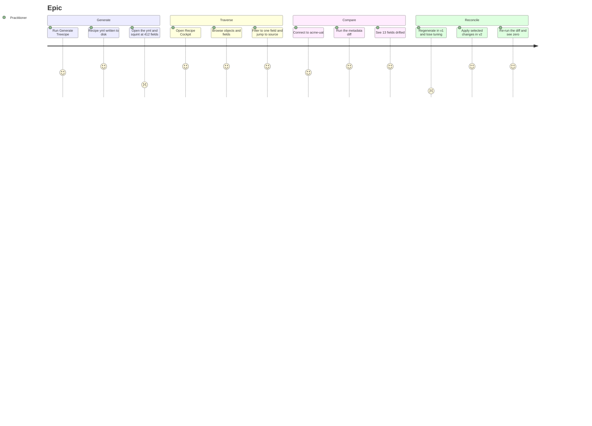

# UX Wireframes & User Journeys — Recipe Cockpit (Epic [#59](https://github.com/jdschleicher/Salesforce-Data-Treecipe/issues/59))

**Component:** Salesforce Data Treecipe — Recipe Cockpit webview
**Branch of record:** `claude/epic-59-wireframes-journeys-conqz4`
**Status:** Design exploration — *no implementation on this branch*. This document is the UX contract the v1 slices are built against.
**Audience:** the implementer of slices [#53](https://github.com/jdschleicher/Salesforce-Data-Treecipe/issues/53)–[#57](https://github.com/jdschleicher/Salesforce-Data-Treecipe/issues/57), and reviewers of the resulting PRs

> **Companion:** [`docs/epic-59-recipe-cockpit-wireframes.html`](./epic-59-recipe-cockpit-wireframes.html) — the same six screens drawn as rendered mockups rather than ASCII.

---

## Contents

| Slice | Issue | Screen | Journey |
|---|---|---|---|
| 1 | [#53](https://github.com/jdschleicher/Salesforce-Data-Treecipe/issues/53) | [Walking skeleton](#slice-1--53-walking-skeleton) | [Journey](#journey--53) |
| 2 | [#54](https://github.com/jdschleicher/Salesforce-Data-Treecipe/issues/54) | [Traverse view](#slice-2--54-traverse-view) | [Journey](#journey--54) |
| 3 | [#55](https://github.com/jdschleicher/Salesforce-Data-Treecipe/issues/55) | [Org connection](#slice-3--55-org-connection) | [Journey](#journey--55) |
| 4 | [#56](https://github.com/jdschleicher/Salesforce-Data-Treecipe/issues/56) | [Diff engine (no UI)](#slice-4--56-metadata-diff-engine) | [Journey](#journey--56) |
| 5 | [#57](https://github.com/jdschleicher/Salesforce-Data-Treecipe/issues/57) | [Diff UI](#slice-5--57-diff-ui) | [Journey](#journey--57) |
| v2 | [#58](https://github.com/jdschleicher/Salesforce-Data-Treecipe/issues/58) | [Write-back (deferred)](#v2--58-write-back-deferred) | [Journey](#journey--58) |

---

## Conventions inherited from the Picklist Dependency Explorer

The Cockpit is the **second** webview in this extension. Where the Explorer already settled a question, the Cockpit answers it the same way rather than inventing a second idiom:

| Property | Established by the Explorer | Applies to the Cockpit |
|---|---|---|
| **Find box is drawn first** | Every other top-level block is a statement *about* the rows; a reader who opened the panel to look one field up should not scroll past banners to reach the only control that gets them there | Yes — `renderToolbar` before the provenance banner |
| **No metadata is interpolated into HTML** | Picklist values, api names and org messages come from metadata the extension does not control; the shell takes a nonce and nothing else, the model arrives by `postMessage`, every node is written with `createElement`/`textContent` | Yes — faker expressions and describe results are the same untrusted class of text |
| **Every panel action is gated by an allow-list built from the rendered model** | `openSource` must *match* a path the view model named, never *validate* a posted path | Yes — `openSource {file,line}` in [#54](https://github.com/jdschleicher/Salesforce-Data-Treecipe/issues/54) |
| **The panel opens before the load and names its phase** | The shell is static, so it is shown immediately; phases are reported with a yield between them, and host messages are stored and posted once the panel signals `ready` | Yes — `readingRecipe` → `describingOrg` → `buildingDiff` |
| **The panel reports its own render failure** | A webview exception never reaches the host; a `rendered` ack distinguishes "a model was sent" from "something is on screen" | Yes |
| **Absent ≠ unknown** | Overlay fields are optional, so a structural build never sets them | Yes — a traverse-only model carries *no* diff status, which is distinct from `unchanged` |

**The one deliberate divergence:** the Explorer renders a picture of *structure* and treats the run overlay as disconnected. The Cockpit's whole point is the overlay — the diff *is* the product. So the diff status is optional on the model (a traverse-only open sets none) but, unlike the Explorer, there is a first-class action that fills it in.

---

## Slice 1 — [#53](https://github.com/jdschleicher/Salesforce-Data-Treecipe/issues/53) Walking skeleton

**What this screen exists to prove:** the webview ⇄ extension-host channel is real. Nothing else.

```
┌─ Recipe Cockpit ────────────────────────────────────────── ⟳  ⋯  ✕ ─┐
│                                                                      │
│  Recipe Cockpit                                                      │
│  Panel connected · handshake completed 12:04:31                      │
│  ───────────────────────────────────────────────────────────────     │
│                                                                      │
│                                                                      │
│              ┌────────────────────────────────────────┐              │
│              │                                        │              │
│              │   No recipe loaded yet.                │              │
│              │                                        │              │
│              │   This panel is the walking skeleton   │              │
│              │   for the Recipe Cockpit. Traversal    │              │
│              │   lands in #54.                        │              │
│              │                                        │              │
│              └────────────────────────────────────────┘              │
│                                                                      │
│                                                                      │
│  ─────────────────────────────────────────────────────────────       │
│  host ⇄ webview   ready ▸ ack   ✓                                    │
└──────────────────────────────────────────────────────────────────────┘
```

**Notes for the implementer**

- The handshake result is rendered as a **visible line**, not only a console log — that line is what makes the acceptance criterion observable without opening devtools.
- Re-running the command **reveals** the panel; the handshake line keeps its original timestamp, which is how a reader tells a reveal from a re-open.
- `buildWebviewShellHtml(nonce)` takes a nonce and nothing else, exactly as the Explorer's does — the placeholder copy above is written by the panel script, not interpolated into the shell.

### Journey — #53

```mermaid
journey
    title #53 · Extension developer proves the webview wiring
    section Discover the command
      Open the command palette: 4: Developer
      Type "Recipe Cockpit": 3: Developer
      Command appears under Salesforce Treecipe: 5: Developer
    section Open the panel
      Run Open Recipe Cockpit: 5: Developer
      Panel opens beside the editor: 5: Developer
      Read the placeholder body: 3: Developer
    section Trust the channel
      See ready to ack confirmed on screen: 5: Developer
      Re-run the command: 4: Developer
      Existing panel is revealed, not duplicated: 5: Developer
      Check devtools for CSP violations: 2: Developer
      Console is clean: 5: Developer
```

**Where the friction is:** typing to find the command (3) and having to open devtools to confirm CSP (2). The first is why the command carries the `Salesforce Treecipe` category; the second is why the handshake is rendered on screen.

---

## Slice 2 — [#54](https://github.com/jdschleicher/Salesforce-Data-Treecipe/issues/54) Traverse view

**What this screen exists to prove:** a user can find one field among thousands, and get from it to the source line.

```
┌─ Recipe Cockpit ────────────────────────────────────────── ⟳  ⋯  ✕ ─┐
│  Recipe Cockpit                                                      │
│  generated 2026-09-04 11:22:07 · run treecipe-2026-09-04T11-22-07Z   │
│  ────────────────────────────────────────────────────────────────    │
│                                                                      │
│  ┌──────────────────────────────────────────┐  ┌─────────────────┐   │
│  │ 🔍 industry                              │  │ Run: latest  ▾  │   │  ← find box FIRST
│  └──────────────────────────────────────────┘  └─────────────────┘   │
│  3 of 412 fields · 2 of 27 objects                                   │
│                                                                      │
│  ⓘ Rows come from treecipeObjectsWrapper-2026-09-04T11-22-07Z.json   │  ← provenance
│                                                                      │
│  ▾ Account                                            14 fields      │
│    ↳ Industry            Picklist                                    │
│        ${{ random_choice('Agriculture','Banking','Retail') }}        │
│    ↳ Industry_Group__c   Picklist  ← controlled by Industry          │
│        ${{ random_choice('Ag Co-op','Retail Bank') }}                │
│                                                                      │
│  ▾ Lead                                                8 fields      │
│    ↳ Industry            Picklist                                    │
│        ${{ random_choice('Agriculture','Banking','Retail') }}        │
│                                                                      │
│  ▸ Contact                                    no matching fields     │
│  ▸ Opportunity                                no matching fields     │
│                                                                      │
└──────────────────────────────────────────────────────────────────────┘
```

**Empty state** — no Generate Treecipe run exists yet:

```
┌─ Recipe Cockpit ─────────────────────────────────────────────────────┐
│  Recipe Cockpit                                                      │
│  ────────────────────────────────────────────────────────────────    │
│                                                                      │
│         No generated recipe found in treecipe/GeneratedRecipes.      │
│                                                                      │
│         The Cockpit reads the wrapper JSON that Generate             │
│         Treecipe writes on every run.                                │
│                                                                      │
│                    [ Run Generate Treecipe ]                         │
│                                                                      │
│         Scanned: <workspace>/treecipe/GeneratedRecipes               │
└──────────────────────────────────────────────────────────────────────┘
```

**Notes for the implementer**

- The row is `fieldName · type · recipeValue` straight off `FieldInfo` — `recipeValue` is the faker expression and it is the reason a user opens this panel at all, so it gets its own line rather than a truncated trailing column.
- `controllingField` is rendered inline (`← controlled by Industry`) because it is already on `FieldInfo` and it is the one relationship a recipe reader cannot infer from the field name.
- **A non-matching object stays on screen collapsed, labelled `no matching fields`** — hiding it entirely makes a filter look like a truncation. The Explorer's rule holds: filtering *hides rows*, it recomputes nothing, and it never re-labels what it drops.
- The **scanned path is revealed last**, after the body it describes has drawn (the Explorer learned this the hard way: a path line written first is what makes a failed render read as a finished one).
- Multiple runs → the run selector is a `<select>` in the toolbar, defaulting to most-recent. The generation stamp in the header names the *selected* run, stated once.

### Journey — #54

```mermaid
journey
    title #54 · Data engineer traverses a generated recipe
    section Arrive with nothing generated
      Open Recipe Cockpit: 4: Data engineer
      Panel shows an empty state: 2: Data engineer
      Read which folder was scanned: 4: Data engineer
      Click Run Generate Treecipe: 4: Data engineer
      Wait for the run to finish: 2: Data engineer
    section Browse the recipe
      Panel lists 27 objects: 5: Data engineer
      Expand Account: 5: Data engineer
      Read each field type and faker expression: 5: Data engineer
      Scroll looking for one picklist: 2: Data engineer
    section Find one field
      Type industry in the find box: 5: Data engineer
      Match count narrows to 3 fields: 5: Data engineer
      See which field controls which: 5: Data engineer
      Click the field row: 5: Data engineer
      Recipe yml opens at that line: 5: Data engineer
```

**Where the friction is:** the cold start (2, 2) and scrolling before the user thinks to filter (2). The empty state's *action button* and the find-box-first layout are the direct answers.

---

## Slice 3 — [#55](https://github.com/jdschleicher/Salesforce-Data-Treecipe/issues/55) Org connection

**What this screen exists to prove:** the user can name an org without typing an alias from memory, and knows what the panel is doing while it waits on the API.

```
┌─ Recipe Cockpit ─────────────────────────────────────────────────────┐
│  ┌────────────────────────────────────────────────────────────────┐  │
│  │ Select an authorized org                                       │  │  ← QuickPick,
│  │────────────────────────────────────────────────────────────────│  │    host-side
│  │ ▸ acme-uat            uat@acme.com          Sandbox            │  │
│  │   acme-dev            dev@acme.com          Scratch · 12d left │  │
│  │   acme-prod           ops@acme.com          Production         │  │
│  │────────────────────────────────────────────────────────────────│  │
│  │ 3 authorized orgs from the Salesforce CLI                      │  │
│  └────────────────────────────────────────────────────────────────┘  │
└──────────────────────────────────────────────────────────────────────┘

┌─ Recipe Cockpit ────────────────────────────────────────── ⟳  ⋯  ✕ ─┐
│  Recipe Cockpit                                                      │
│  ────────────────────────────────────────────────────────────────    │
│  ┌──────────────────────────────────────────┐  ┌─────────────────┐   │
│  │ 🔍                                       │  │ Run: latest  ▾  │   │
│  └──────────────────────────────────────────┘  └─────────────────┘   │
│                                                                      │
│  ⓘ acme-uat · describing 27 objects            ▓▓▓▓▓▓▓▓░░░░  19/27   │  ← phase banner
│                                                                      │
│  ▾ Account                     ✓ described · 61 fields               │
│  ▾ Contact                     ✓ described · 44 fields               │
│  ▾ Opportunity                 ⋯ describing…                         │
│  ▸ Custom_Thing__c             · queued                              │
│                                                                      │
└──────────────────────────────────────────────────────────────────────┘

  ── failure variant ────────────────────────────────────────────────
│  ⚠ acme-uat · Custom_Thing__c: INVALID_TYPE — the object is not      │
│    visible to ops@acme.com. 26 of 27 objects described.              │
│    [ Retry ]  [ Choose another org ]                                 │
```

**Notes for the implementer**

- **No authorized orgs** is its own state, not an error toast: *"No authorized orgs found. Run `sf org login web` and reopen."*
- A describe failure on **one** object must not discard the other 26. The banner names the object, the reason and the count — a single-line "describe failed" sends the user hunting.
- Cache: repeat requests in a session don't re-hit the API. The banner says `cached` rather than silently returning instantly, so a user who *wants* fresh metadata knows to hit ⟳.
- The picker lives on the **host** (`vscode.window.showQuickPick`), not in the webview — it is `AuthInfo.listAllAuthorizations()` output, and the webview never sees credentials.

### Journey — #55

```mermaid
journey
    title #55 · Release manager points the cockpit at a live org
    section Choose an org
      Click Connect to org: 5: Release manager
      Wait for authorizations to list: 3: Release manager
      Recognize aliases without typing one: 5: Release manager
      Pick acme-uat: 5: Release manager
    section Fetch metadata
      Panel reports describing 27 objects: 4: Release manager
      Watch the count climb: 3: Release manager
      One object fails on visibility: 1: Release manager
      Read which object and why: 4: Release manager
      Continue with the other 26: 4: Release manager
    section Come back later
      Re-request describe in the same session: 5: Release manager
      Results return instantly from cache: 5: Release manager
      Force a refresh when the org changed: 4: Release manager
```

**Where the friction is:** the single-object permission failure (1). That score is the whole argument for a partial-success banner instead of a thrown error.

---

## Slice 4 — [#56](https://github.com/jdschleicher/Salesforce-Data-Treecipe/issues/56) Metadata diff engine

**This slice has no screen.** It is a pure, `vscode`-free, `@salesforce/core`-free function. What it *does* have is an output contract the UI in [#57](https://github.com/jdschleicher/Salesforce-Data-Treecipe/issues/57) renders directly — so the "wireframe" here is that contract, drawn as data.

```
   recipe field set                          org describe (normalized)
   from ObjectInfoWrapper  ──┐            ┌── from #55
                             │            │
                             ▼            ▼
                   ┌───────────────────────────────┐
                   │   computeMetadataDiff()       │
                   │   pure · deterministic        │
                   │   no vscode · no @salesforce  │
                   └───────────────┬───────────────┘
                                   ▼
   ┌──────────────────────────────────────────────────────────────────┐
   │ object          field                status            detail    │
   ├──────────────────────────────────────────────────────────────────┤
   │ Account         Industry             unchanged             —     │
   │ Account         Segment__c           new-in-org       org only   │
   │ Account         Legacy_Code__c       removed-from-org recipe only│
   │ Account         AnnualRevenue        type-changed  Currency→Number│
   │ Account         Industry_Group__c    picklist-changed +2 / −1    │
   │ Rollup__c       (whole object)       new-in-org       org only   │
   │ Retired__c      (whole object)       removed-from-org recipe only│
   └──────────────────────────────────────────────────────────────────┘
        sorted by object api name, then field api name — stably
```

**Notes for the implementer**

- **Ordering is a property, not an accident.** Sorted by object then field, always. The Explorer's lesson applies: an unasserted order is one a refactor turns into "whatever the iteration produced", and then a reader cannot tell a moved row from a changed one. Assert it.
- **Objects present on only one side** are first-class rows, not a thrown error and not silence.
- `picklist-changed` carries **which** values were added and removed, not just a boolean — the UI renders the values, and a diff that only says "changed" sends the user to Setup to find out what.
- The shared field-model type is defined **once** and consumed by both the recipe side ([#54](https://github.com/jdschleicher/Salesforce-Data-Treecipe/issues/54)) and the describe side ([#55](https://github.com/jdschleicher/Salesforce-Data-Treecipe/issues/55)). Two near-identical types is how the two sides drift.

### Journey — #56

*This is the one journey with no end user in it.* The slice ships no surface a Salesforce practitioner can touch, so modelling a practitioner journey here would be fiction. The person who lives with this slice is the contributor.

```mermaid
journey
    title #56 · Contributor builds and trusts the classifier
    section Define the contract
      Read the recipe field model: 4: Contributor
      Read the describe field model: 4: Contributor
      Find the two shapes nearly identical: 2: Contributor
      Extract one shared field type: 5: Contributor
    section Write fixtures first
      Write a fixture per category: 4: Contributor
      Add objects present on one side only: 3: Contributor
      Add a picklist add and remove case: 4: Contributor
    section Verify
      Run npx jest RecipeCockpitService: 5: Contributor
      Watch branch coverage on the classifier: 4: Contributor
      Assert output ordering is stable: 5: Contributor
      Confirm no vscode import leaked in: 5: Contributor
```

**Where the friction is:** discovering the two field shapes are near-duplicates (2) and the one-sided-object cases (3) — both are the places a reviewer should look hardest.

---

## Slice 5 — [#57](https://github.com/jdschleicher/Salesforce-Data-Treecipe/issues/57) Diff UI

**What this screen exists to prove:** a user can answer "has my org drifted from my recipe?" in one glance, and narrow to only what changed.

```
┌─ Recipe Cockpit ────────────────────────────────────────── ⟳  ⋯  ✕ ─┐
│  Recipe Cockpit                                                      │
│  generated 2026-09-04 11:22:07 · diffed against acme-uat 12:41:09    │
│  ────────────────────────────────────────────────────────────────    │
│                                                                      │
│  ┌──────────────────────────────────────────┐  ┌─────────────────┐   │
│  │ 🔍                                       │  │ acme-uat     ▾  │   │
│  └──────────────────────────────────────────┘  └─────────────────┘   │
│                                                                      │
│  [ all 412 ]  [ ● new 6 ]  [ ● removed 2 ]  [ ● type 1 ]             │  ← status filter
│  [ ● picklist 4 ]  [ changed only 13 ]                               │
│                                                                      │
│  ⓘ 27 objects · 412 fields · 13 changed · 399 unchanged              │
│                                                                      │
│  ▾ Account                            ● 2  ● 1  ● 1                  │
│    ↳ Segment__c            Picklist            ● new-in-org          │
│        Not in the recipe. Regenerate to pick it up.                  │
│    ↳ Legacy_Code__c        Text(40)            ● removed-from-org    │
│        ${{ fake: word }}                                             │
│        In the recipe, absent from acme-uat.                          │
│    ↳ AnnualRevenue         Currency(18,2)      ● type-changed        │
│        recipe Currency(16,2)  →  org Currency(18,2)                  │
│    ↳ Industry_Group__c     Picklist            ● picklist-changed    │
│        + Ag Co-op  + Credit Union   − Savings & Loan                 │
│                                                                      │
│  ▾ Opportunity                                 no changes            │
│                                                                      │
│  ─────────────────────────────────────────────────────────────       │
│  Recipe is behind the org in 13 places.   [ Regenerate recipe ]      │
└──────────────────────────────────────────────────────────────────────┘
```

**Notes for the implementer**

- **Badges overlay the traverse rows from [#54](https://github.com/jdschleicher/Salesforce-Data-Treecipe/issues/54); this is not a second view.** The diff status is *optional* on the node model — a traverse-only open sets none, and absent stays distinct from `unchanged`.
- **Status is encoded twice**: color *and* the word. Color alone fails a colour-blind reader and fails a screenshot in a ticket.
- **`removed-from-org` shows the recipe's faker expression**; `new-in-org` shows none, because there isn't one — that asymmetry is the information.
- The **"Regenerate recipe" button re-runs the existing `treecipe.generateTreecipe` command**. It is deliberately *not* labelled "Apply" — nothing is written back in v1, and a button that implies a patch it does not perform is a lie ([#58](https://github.com/jdschleicher/Salesforce-Data-Treecipe/issues/58) is where it becomes true).
- The `changed only` chip is the one most users want first; it is last in the row because the counts before it are what tell them whether to bother.
- Errors surface **in-panel** (the [#55](https://github.com/jdschleicher/Salesforce-Data-Treecipe/issues/55) banner), not as a toast that disappears while the user is reading the table.

### Journey — #57

```mermaid
journey
    title #57 · Admin checks whether the recipe still matches the org
    section Ask the question
      Open the cockpit on an existing recipe: 5: Admin
      Pick acme-uat and run the diff: 5: Admin
      Watch describe progress: 3: Admin
    section Read the answer
      See 13 changed of 412: 5: Admin
      Filter to changed only: 5: Admin
      Read new-in-org fields: 5: Admin
      Read the picklist values added and removed: 5: Admin
      See a type narrowed from 18,2 to 16,2: 4: Admin
    section Act
      Realize the recipe is stale: 2: Admin
      Click Regenerate recipe: 4: Admin
      Wait for Generate Treecipe: 2: Admin
      Re-run the diff and see zero changes: 5: Admin
    section Hit the v1 wall
      Want to keep a hand-tuned faker expression: 1: Admin
      Regeneration overwrites it: 1: Admin
```

**Where the friction is:** the last section. Regeneration is a blunt instrument — it is the v1 answer, and its score of 1 is precisely the case [#58](https://github.com/jdschleicher/Salesforce-Data-Treecipe/issues/58) exists to fix. This journey is the strongest available argument for prioritising the v2 slice.

---

## v2 — [#58](https://github.com/jdschleicher/Salesforce-Data-Treecipe/issues/58) Write-back (deferred)

Drawn dashed throughout: **this is not v1 scope.** It is here because the [#57](https://github.com/jdschleicher/Salesforce-Data-Treecipe/issues/57) journey ends on a score of 1, and the wireframe is the cheapest way to argue what the fix has to look like.

```
┌─ Apply diff to recipe ─────────────────────────────── (v2, deferred) ┐
│                                                                      │
│  13 changes · 8 selected                                             │
│                                                                      │
│  [✓] Account.Segment__c            new-in-org      add field         │
│  [✓] Account.Industry_Group__c     picklist        reconcile values  │
│  [ ] Account.Legacy_Code__c        removed         remove field      │
│  [✓] Account.AnnualRevenue         type-changed    Currency(18,2)    │
│                                                                      │
│  ── preview ────────────────────────────────────────────────────     │
│  Account.yml                                                         │
│    - AnnualRevenue: ${{ fake_number(max=9999999999999999, dec=2) }}  │
│    + AnnualRevenue: ${{ fake_number(max=999999999999999999, dec=2) }}│
│    + Segment__c: ${{ random_choice('Enterprise','Mid-Market') }}     │
│      Industry: ${{ random_choice(...) }}      ← untouched            │
│                                                                      │
│  ⚠ Recipes are emitted as template strings, not yaml.dump.           │
│    Serialization fidelity is the open design question — see #58.     │
│                                                                      │
│                       [ Cancel ]   [ Apply 8 changes ]               │
└──────────────────────────────────────────────────────────────────────┘
```

**The design constraint that defers this slice:** `RecipeService` assembles YAML as hand-built template strings; js-yaml is used only for *reading*. A `yaml.dump` round-trip would reformat and drop comments across the whole file, so the preview above implies **targeted line-level patching** — and the preview is not decoration, it is the mechanism by which a user can trust a patch that a round-trip cannot guarantee.

### Journey — #58

```mermaid
journey
    title #58 · Admin applies a diff without losing hand-tuned values
    section Select
      Run the diff and see 13 changes: 5: Admin
      Open Apply diff to recipe: 5: Admin
      Uncheck the removal to keep a field: 5: Admin
      Keep 8 of 13 changes: 5: Admin
    section Trust the patch
      Read the per-file preview: 5: Admin
      Confirm hand-tuned expressions are untouched: 5: Admin
      Worry about comment and format loss: 2: Admin
      See only the named lines change: 5: Admin
    section Apply
      Click Apply 8 changes: 4: Admin
      Recipe yml updates on disk: 5: Admin
      Check git diff: 5: Admin
      Diff is 3 lines, not a whole-file reformat: 5: Admin
```

**Where the friction is:** the format-loss worry (2) — which is exactly the risk the issue names, and the reason the preview pane is load-bearing rather than a nicety.

---

## Cross-cutting: what the whole epic feels like end to end



The shape of this diagram is the epic's argument: **the only score below 3 after the Cockpit exists is the v1 reconcile step.** Everything the Cockpit adds is a 4 or 5; the one remaining trough is [#58](https://github.com/jdschleicher/Salesforce-Data-Treecipe/issues/58).

---

## Open UX questions for the epic owner

1. **Run selection ([#54](https://github.com/jdschleicher/Salesforce-Data-Treecipe/issues/54))** — the issue offers "most recent, *or* a QuickPick to choose". The wireframe puts a `<select>` in the toolbar instead, so the choice is visible without a second command. Confirm.
2. **Where does "Connect to org" live?** The wireframe puts it in the toolbar as the org `<select>`; the issue describes a QuickPick. The QuickPick is still the picker — the toolbar control is what *launches* it and then shows the result.
3. **Does the diff run automatically on org selection, or on an explicit "Run diff"?** The wireframe assumes automatic-on-select, since selecting an org has no other purpose in v1.
4. **Field count ceiling.** The Explorer needed `applyModelLimits` at scale. 412 fields is fine; a 12,000-field org is not obviously fine over `postMessage`. Worth a measurement before [#57](https://github.com/jdschleicher/Salesforce-Data-Treecipe/issues/57) rather than after.
