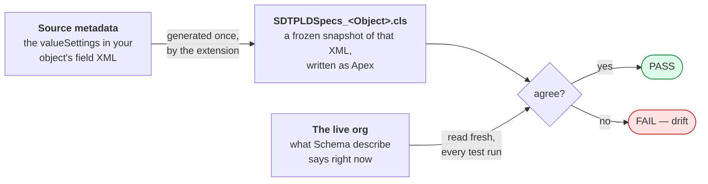
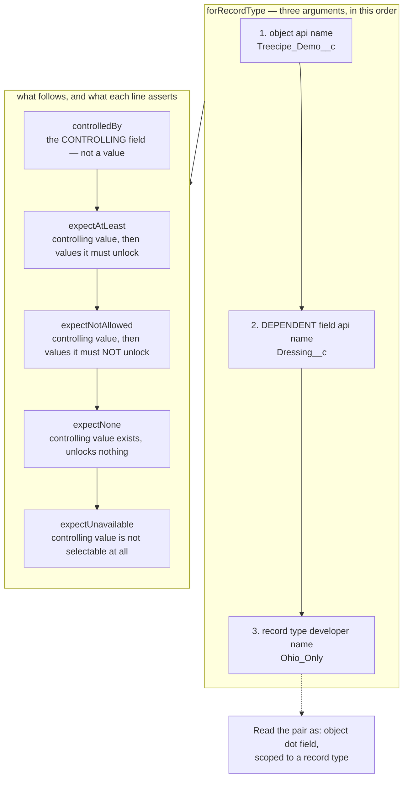
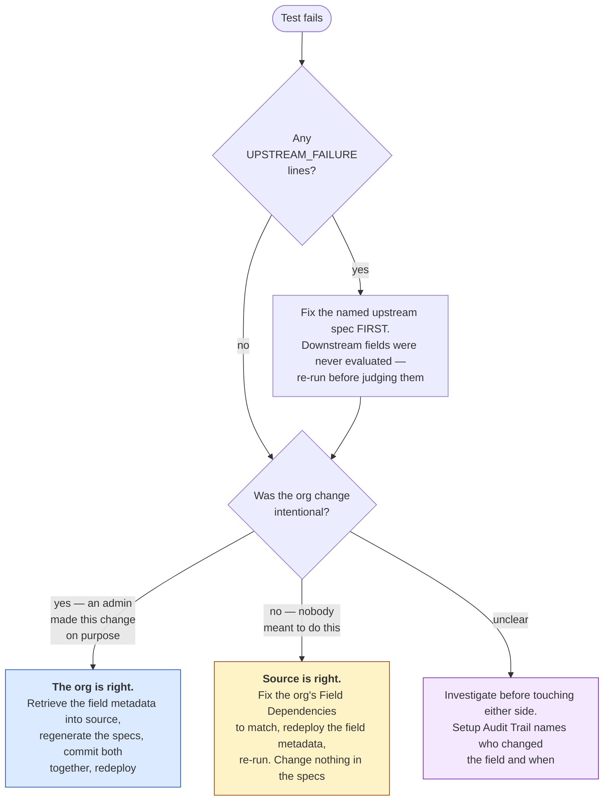

# Working With the Picklist Dependency Classes Inside a Salesforce Org

**Audience:** the admin or developer who is looking at `SDTPLDSpecsTest` in a Salesforce org and wants to know what it is, where its answers come from, and what to do when it goes red.

This guide is written from *inside the org*. It assumes nothing about VS Code. If you want the extension commands that put these classes here, see [README §5 and §6](../README.md#5-salesforce-treecipe-generate-picklist-dependency-tests). If you want the design rationale, see the [technical design record](./PICKLIST-DEPENDENCY-TECHNICAL-DESIGN.md).

---

## Table of contents

1. [The one-paragraph mental model](#1-the-one-paragraph-mental-model)
2. [What is actually in your org](#2-what-is-actually-in-your-org)
3. [Reading a spec class](#3-reading-a-spec-class)
4. [Where the *org* side of the comparison comes from](#4-where-the-org-side-of-the-comparison-comes-from)
5. [Running the tests inside the org](#5-running-the-tests-inside-the-org)
6. [Anatomy of a failure message](#6-anatomy-of-a-failure-message)
7. [Triggering a failure on purpose](#7-triggering-a-failure-on-purpose)
8. [Fixing a real failure](#8-fixing-a-real-failure)
9. [Behaviours that surprise people](#9-behaviours-that-surprise-people)
10. [Removing it all](#10-removing-it-all)

---

## 1. The one-paragraph mental model

There are **two** descriptions of your picklist dependencies, and this test class exists to prove they still agree.



The spec class is a **frozen** copy of your source metadata, written at generation time. The org side is read **live** on every run. So a failure never means "the code broke" — it means **the org and your source metadata have diverged since the specs were generated.** Deciding which of the two is now correct is a human judgement, and [§8](#8-fixing-a-real-failure) walks it.

---

## 2. What is actually in your org

Setup → **Apex Classes**, filter on `SDT`. You will see two distinct groups.

### The framework — six classes you did not write, and should not edit

All under a `SDTPicklistDependencyFramework` folder in source. They deploy as ordinary `ApexClass` records; Salesforce resolves classes by the enclosing `classes` directory and walks nested folders, so the subfolder is a source-side organisation only.

| Class | What it does |
|---|---|
| `SDTPicklistDependencySpec` | The fluent DSL — `forField(...).controlledBy(...).expectAtLeast(...)`. Holds one expectation per controlling value |
| `ISDTPicklistDependencySource` | The boundary interface. Exists so the validator can be unit-tested against a stub instead of a real org |
| `SDTSchemaPicklistDependencySource` | The real implementation. Calls `Schema` describe and decodes the dependency matrix |
| `SDTPicklistDependencySnapshot` | A plain, ConnectApi-free representation of what the org said |
| `SDTPicklistDependencyValidator` | Compares specs against snapshots and returns `Failure` records. Never throws on a mismatch |
| `SDTPicklistDependencyReport` | Formats a run into a readable summary plus a `PICKLIST_DEPENDENCY_CHECK_RESULT=PASS\|FAIL\|EMPTY` marker. Nothing ships that calls it — it is there for a diagnostic run or a pipeline of your own |

### The generated contract — the part that is *yours*

| Class | What it is |
|---|---|
| `SDTPLDSpecs_<Object>` | One per object that has dependent picklists. One method per dependent picklist on that object |
| `SDTPLDSpecs` | The aggregator. `all()` returns every spec from every per-object class |
| `SDTPLDSpecsTest` | The `@IsTest` class. One test method per object, plus a guard that an empty registry can never pass |

Every one of these carries `GENERATED FILE -- regenerating overwrites it.` at the top, and means it. Hand edits survive in the org until the next generation run, and are then silently replaced. If you want a permanent tightening, [§9](#9-behaviours-that-surprise-people) covers where that leaves you.

Everything is `SDT`-prefixed specifically so it cannot collide with your own Apex.

---

## 3. Reading a spec class

Open `SDTPLDSpecs_<Object>` in the Developer Console. A method looks like this.

> The api names, picklist values and record type names throughout this section are invented to show the **shape** of a generated method. They are not drawn from any particular org, from the demo project, or from the test fixtures, and your generated classes will not match them line for line. What transfers is the structure: which argument sits where, and what each line asserts.

```apex
// Treecipe_Demo__c.Dressing__c controlled by Neighborhood__c
public static SDTPicklistDependencySpec specFor_Treecipe_Demo_c_Dressing_c() {
    return SDTPicklistDependencySpec.forField('Treecipe_Demo__c', 'Dressing__c')
            .controlledBy('Neighborhood__c')
            .dependsOn(specFor_Treecipe_Demo_c_Neighborhood_c())
            .expectAtLeast('ohiocity', new List<String>{ 'ranch', 'french' })
            .expectNotAllowed('ohiocity', new List<String>{ 'blue cheese' })
            .expectAtLeast('tremont', new List<String>{ 'blue cheese' })
            .expectNotAllowed('tremont', new List<String>{ 'ranch', 'french' })
            .expectNone('willowick');
}
```

Line by line:

| Line | Asserts |
|---|---|
| `forField('Treecipe_Demo__c', 'Dressing__c')` | The dependent picklist under test |
| `.controlledBy('Neighborhood__c')` | The org must agree this is the controlling field. If the org names a different one, you get `CONTROLLING_FIELD_MISMATCH` and **nothing else on this field is evaluated** |
| `.dependsOn(...)` | `Neighborhood__c` is *itself* a dependent picklist. Validate that spec first; if it fails, report this one as `UPSTREAM_FAILURE` rather than repeating the same break |
| `.expectAtLeast('ohiocity', {...})` | Selecting `ohiocity` must unlock **at least** `ranch` and `french`. Extra values the org has since added are tolerated |
| `.expectNotAllowed('ohiocity', {...})` | Selecting `ohiocity` must unlock **none of** `blue cheese` |
| `.expectNone('willowick')` | `willowick` must exist as a controlling value and unlock **nothing at all** |
| `.expectUnavailable('tremont')` | Record type scoped specs only: `tremont` must **not be selectable** under this record type. The value being absent is the passing result |

**Why every controlling value gets a pair of lines.** `expectAtLeast` alone would not notice a value *drifting into* a combination it does not belong in — usually a mistake, sometimes a compliance problem. `expectExactly` would fail every time an admin *deliberately* adds a value — usually intended. The `expectAtLeast` + `expectNotAllowed` pair catches removals and unintended additions while tolerating deliberate ones. The `expectNotAllowed` list is derived as *every value the dependent field declares, minus the ones this controlling value unlocks*.

`expectExactly` exists and is stricter, but the generator never emits it. Using it is a deliberate hand edit — and is lost on the next generation.

### Which argument is which

The first two arguments are read as one pair — `Object.Field` — and the field is the **dependent** picklist, the one whose available values change. The controlling field is never an argument to `forField` or `forRecordType`: it arrives on the next line, in `controlledBy`. Values only ever appear inside the `expect...` lines.



The mistake worth naming: `forRecordType('Treecipe_Demo__c', 'Dressing__c', 'Ohio_Only')` is object, **field**, record type. It is not object, record type, field — the record type is last, and it is a developer name rather than a label or an id.

### A record type scoped spec

Where an object has record types, each dependent picklist gets the field-level method above **plus** one method per record type, collected by `recordTypeSpecs()` on the same class:

```apex
// Treecipe_Demo__c.Dressing__c controlled by Neighborhood__c for record type Ohio_Only
public static SDTPicklistDependencySpec specFor_Treecipe_Demo_c_Dressing_c_recordType_Ohio_Only() {
    return SDTPicklistDependencySpec.forRecordType('Treecipe_Demo__c', 'Dressing__c', 'Ohio_Only')
            .controlledBy('Neighborhood__c')
            .expectAtLeast('ohiocity', new List<String>{ 'ranch' })
            .expectNotAllowed('ohiocity', new List<String>{ 'blue cheese' })
            .expectUnavailable('tremont');
}
```

Set beside the field-level method above, the two illustrate the narrowing. In this example the record type assigns fewer values than the field declares, so `ohiocity` unlocks a shorter list; a value the record type does not assign drops out of the allowed **and** the forbidden list rather than becoming forbidden; and a controlling value it does not assign at all becomes `expectUnavailable`. Which values those are in your org depends entirely on your record type's picklist assignments.

| Line | Asserts |
|---|---|
| `forRecordType(object, field, recordType)` | The same dependent picklist, narrowed to what one record type exposes |
| `.expectUnavailable('tremont')` | The controlling value is **not selectable** under this record type. Different from `expectNone`, which requires the value to exist and unlock nothing |

**Two rules that explain what you will not see.** A value the record type does not assign to the dependent field never appears — not in the allowed list, and not in the forbidden one, because the forbidden list is the complement against what the *record type* assigns, not against everything the field declares. And a field the record type's metadata never mentions produces no scoped method at all: it is treated as unassigned rather than as fully assigned, and the generation run reports it as a skipped combination.

**These are not run by the generated test class, on purpose.** Apex `Schema` describe returns picklist values with no record type filtering, so nothing that ships with the framework can check a scoped spec against an org. `SDTPLDSpecsTest` asserts `SDTPLDSpecs.all()`, which holds the field-level specs only; the scoped ones sit in `SDTPLDSpecs.allRecordTypeScoped()`, and `SDTSchemaPicklistDependencySource` throws if handed one rather than answering it with field-level data and reporting a scope it never checked as green. They are a captured contract, readable and deployable, waiting on a record-type-aware source. The Picklist Dependency Explorer shows them for the same reason, and marks them "not checked" rather than green.

> **Method naming.** The method is `..._Treecipe_Demo_c_...`, not `..._Treecipe_Demo__c_...`. Apex identifiers may not contain two consecutive underscores, so runs of underscores in an API name are collapsed. The API name itself is passed as a string literal and keeps its exact `__c` suffix, so describe still resolves the real object.

---

## 4. Where the *org* side of the comparison comes from

### What you can see in Setup

Setup → **Object Manager** → your object → **Fields & Relationships** → the **Field Dependencies** button. That page lists each dependent field and its controlling field; opening one shows the matrix grid — controlling values across the top, dependent values down the side, each cell included or excluded.

**That grid is exactly what the test reads.** If a cell in the grid disagrees with a line in the spec class, the test fails. Reading the grid alongside the spec method from [§3](#3-reading-a-spec-class) is the fastest way to see a drift with your own eyes.

### How the code gets at it

Apex's `Schema.PicklistEntry` has **no** `getValidFor()` accessor. The dependency matrix is reachable only through an undocumented property of `JSON.serialize(entry)`, which emits a `validFor` key holding a base64-encoded bitmap. Set bits are indexes into the **controlling field's own `getPicklistValues()` order**. `SDTSchemaPicklistDependencySource` decodes that bitmap into the plain snapshot the validator compares against.

Two consequences worth knowing:

- The order of values on the *controlling* field is load-bearing. It is how the bits are addressed.
- If that undocumented `validFor` key ever disappears for a field the org considers dependent, the source class throws a loud, specific exception rather than reporting `MISSING_VALUES` on everything — which would read like "an admin deleted all the dependencies."

### Ask the org directly

To see the org's own view with no spec involved, run this in the Developer Console (**Debug → Open Execute Anonymous Window**, tick *Open Log*):

```apex
SDTPicklistDependencySpec spec = SDTPicklistDependencySpec
        .forField('Treecipe_Demo__c', 'Planet__c');

SDTPicklistDependencySnapshot snapshot =
        new SDTSchemaPicklistDependencySource().fetch(spec);

System.debug('controlling field: ' + snapshot.controllingFieldApiName);
for (String controllingValue : snapshot.controllingValues()) {
    System.debug(controllingValue + ' -> ' + String.valueOf(snapshot.valuesValidFor(controllingValue)));
}
```

This is the single most useful diagnostic in the whole component: it prints the org's live answer, in the same vocabulary the spec is written in, so you can diff the two by eye.

You can also run the whole check outside the test framework, which prints every failure at once as a readable report:

```apex
List<SDTPicklistDependencySpec> specs = SDTPLDSpecs.all();
List<SDTPicklistDependencyValidator.Failure> failures =
        new SDTPicklistDependencyValidator(new SDTSchemaPicklistDependencySource()).validate(specs);

SDTPicklistDependencyReport report = SDTPicklistDependencyReport.build(specs, failures);
System.debug(report.toDisplayString());
System.debug(report.resultMarker());   // PICKLIST_DEPENDENCY_CHECK_RESULT=PASS | FAIL | EMPTY
```

> **Both snippets are diagnostics, not the gate.** They run as *you*: anonymous Apex executes against the running user's permissions, while `SDTPLDSpecsTest` runs in system context. A user without visibility on a field can get a different — and misleading — answer here. That difference is exactly why no anonymous-Apex entry point ships and why the supported check runs only from the deployed test class. Use these to *investigate*; trust the test run. See [§9](#9-behaviours-that-surprise-people).

---

## 5. Running the tests inside the org

Four ways, all running the same assertions:

| Where | How |
|---|---|
| **Setup** | Setup → **Apex Test Execution** → *Select Tests* → tick `SDTPLDSpecsTest` → Run |
| **Developer Console** | **Test → New Run** → select `SDTPLDSpecsTest` → Run. Failures appear in the Tests tab with the full assert message |
| **CLI** | `sf apex run test --tests SDTPLDSpecsTest --result-format human --wait 10 --target-org <alias>` |
| **VS Code** | The *Run Picklist Dependency Check* command, which wraps the CLI call and writes a report to disk |

### During a deployment

`SDTPLDSpecsTest` is an ordinary Apex test, so it participates in deployment test runs like any other:

- **`RunLocalTests` / `RunAllTestsInOrg`** (which production deployments require) will run it. **Real dependency drift will therefore fail your production deployment.** That is the intended behaviour — but decide deliberately that you want it, because it turns picklist drift into a release blocker.
- **`RunSpecifiedTests`** — name it explicitly to gate on it: `--tests SDTPLDSpecsTest`.

### What passing and failing look like

A pass is unremarkable: one green method per object, plus `specRegistryIsNotEmpty`.

The empty-registry guard deserves a note. If `SDTPLDSpecs.all()` returned nothing, every per-object method would trivially pass and the suite would go green having verified **nothing at all**. `specRegistryIsNotEmpty` fails loudly instead. `SDTPicklistDependencyReport` encodes the same condition as a distinct `EMPTY` marker rather than folding it into `PASS`, for the same reason — so if you build a pipeline on that marker, treat `EMPTY` as a failure.

---

## 6. Anatomy of a failure message

Every failure line follows one grammar:

```
KIND — Object.Field @ controllingValue: message
```

A record type scoped failure names its scope between the field and the controlling value, so the same drift under two record types cannot read as one repeated failure:

```
KIND — Object.Field [RecordTypeDeveloperName] @ controllingValue: message
```

A full assert message wraps those lines with a count:

```
Picklist dependency drift on Treecipe_Demo__c -- 2 combination(s) no longer match local source metadata:
  - MISSING_VALUES — Treecipe_Demo__c.Planet__c @ ohiocity: Expected values no longer valid: [mars]
  - FORBIDDEN_VALUES_PRESENT — Treecipe_Demo__c.Planet__c @ willowick: Org unlocks values this controlling value must not unlock: [mars]
```

Read that as: *`mars` used to be available under `ohiocity` and no longer is; it is now available under `willowick`, where the contract says it must not be.* One value was rewired, and the pair of assertions caught both halves of the move.

### The failure kinds

| Kind | Means | Where to look first |
|---|---|---|
| `MISSING_VALUES` | The org no longer unlocks a value the contract requires | Field Dependencies grid: the cell was unchecked, or the value was rewired elsewhere |
| `FORBIDDEN_VALUES_PRESENT` | The org unlocks a value the contract forbids for that controlling value | The same grid: a cell was checked that should not be |
| `UNEXPECTED_VALUES` | Only from a hand-tightened `expectExactly` line: the org exposes values not listed | Either the org added a value legitimately, or the `expectExactly` should be relaxed |
| `UNKNOWN_CONTROLLING_VALUE` | The contract names a controlling value the org does not have. The message lists what the org *does* have | The controlling picklist — a value was renamed, deactivated, or deleted |
| `UNEXPECTED_CONTROLLING_VALUE` | An `expectUnavailable` line found the controlling value reachable after all. Record type scoped specs only | The record type's picklist assignments — it was given a controlling value it should not expose |
| `CONTROLLING_FIELD_MISMATCH` | The org says a *different* field controls this one. Short-circuits the whole spec | The field's Controlling Field setting was changed |
| `UPSTREAM_FAILURE` | This field's controlling field is itself a broken dependent picklist. **Not evaluated.** The message names which spec to fix first | Go fix the named upstream spec; this one will very likely resolve with it |
| `CIRCULAR_DEPENDENCY` | A `dependsOn` chain loops. Salesforce cannot produce this — a hand edit did | The `dependsOn` lines in the generated classes |
| `LOOKUP_ERROR` | The field or object could not be described at all | The object/field still exists? Renamed? Is it actually a dependent picklist? |

Two behaviours make these lists trustworthy:

- **A broken spec never hides the others.** Each source exception is caught per spec and reported as `LOOKUP_ERROR`, and the remaining specs are still validated. You get the whole picture in one run.
- **A break is reported once, at its source.** Without that, a broken controlling field would repeat the same describe mismatch down every dependent link and bury the one fact that matters. That is what `UPSTREAM_FAILURE` is for — and it is why the failure count on a chained break can look small relative to the damage.

---

## 7. Triggering a failure on purpose

Worth doing once in a sandbox or scratch org. A gate you have never seen fail is a gate you do not trust.

### The one thing that does *not* work

**Do not try to break it by deleting a `<valueSettings>` entry from the field XML and deploying.** Salesforce **merges** `valueSettings` on a `CustomField` deploy: an entry left out of the payload is *not* removed from the org, the deploy still returns `Succeeded` (often reporting the component as `Unchanged`), and the check then correctly reports PASS against an org that never changed. This was verified against a scratch org by dumping the live describe before and after such a deploy.

### What does work: rewire a value

Moving an entry that is still present **is** applied — and it is what an admin actually does in Setup.

**Via the UI:**

1. Setup → **Object Manager** → your object → **Fields & Relationships** → **Field Dependencies**
2. Click **Edit** next to the dependent field
3. In the matrix, pick a dependent value under one controlling value and **Exclude Values**; pick the same value under a *different* controlling value and **Include Values**
4. **Save**
5. Re-run `SDTPLDSpecsTest`

**Via metadata:** change the `controllingFieldValue` on an existing `valueSettings` entry and deploy the field. Do **not** regenerate the specs afterwards — regenerating rewrites the contract to match the drift and hides the very problem you are trying to see.

### What to expect

Rewiring one value fires **two** failures, because the pair of assertions catches both halves of the move:

```
FAIL  Treecipe_Demo_c_picklistDependenciesMatchSourceMetadata
      Picklist dependency drift on Treecipe_Demo__c -- 2 combination(s) no longer match local source metadata:
        - MISSING_VALUES — Treecipe_Demo__c.Planet__c @ ohiocity: Expected values no longer valid: [mars]
        - FORBIDDEN_VALUES_PRESENT — Treecipe_Demo__c.Planet__c @ willowick: Org unlocks values this controlling value must not unlock: [mars]
```

Now rewire a value on a **controlling** field instead — one that other dependent picklists sit below — and the shape changes completely:

```
FAIL  Treecipe_Demo_c_picklistDependenciesMatchSourceMetadata
      Picklist dependency drift on Treecipe_Demo__c -- 4 combination(s) no longer match local source metadata:
        - UPSTREAM_FAILURE — Treecipe_Demo__c.Dressing__c: Controlling field spec Treecipe_Demo__c.Neighborhood__c failed (MISSING_VALUES), so this spec was not evaluated. Fix Treecipe_Demo__c.Neighborhood__c first.
        - MISSING_VALUES — Treecipe_Demo__c.Neighborhood__c @ cle: Expected values no longer valid: [tremont]
        - FORBIDDEN_VALUES_PRESENT — Treecipe_Demo__c.Neighborhood__c @ eastlake: Org unlocks values this controlling value must not unlock: [tremont]
        - UPSTREAM_FAILURE — Treecipe_Demo__c.Planet__c: Controlling field spec Treecipe_Demo__c.Neighborhood__c failed (MISSING_VALUES), so this spec was not evaluated. Fix Treecipe_Demo__c.Neighborhood__c first.
```

Two real failures at the source, and two `UPSTREAM_FAILURE` lines telling you the downstream fields were **not evaluated** and naming what to fix first. That is the chain behaviour doing its job: you are told one thing is broken, not four.

### Putting it back

**Rewire back.** Re-adding an entry that was never actually removed does nothing, for the same merge reason as above. Then re-run the test and confirm you are green before trusting the gate again.

---

## 8. Fixing a real failure

The whole decision reduces to one question: **is the org right, or is source right?**



### If the org is right — accept the change

The dependency genuinely changed and the change is wanted. Source metadata is stale.

1. Retrieve the field metadata from the org into your project
2. Re-run **Generate Picklist Dependency Tests** so the specs are rebuilt from the newly-retrieved XML
3. Commit the retrieved metadata **and** the regenerated specs together — they are one change, and splitting them leaves the next person with a contract that does not match its own source
4. Redeploy and re-run

Regenerating **always** redeploys in the extension's end-to-end path, deliberately: the classes were just rewritten, so the org copy is stale by definition.

### If source is right — fix the org

The dependency was changed by mistake. The contract is doing exactly what you deployed it to do.

1. Correct the Field Dependencies grid in the org, or redeploy the field metadata from source
2. Remember the merge behaviour: to *remove* an unwanted combination you must rewire it, not omit it from a deploy payload
3. Re-run the test. **Do not touch the spec classes** — editing them to match a mistake is how a contract test quietly becomes worthless

### If it is unclear

Setup → **View Setup Audit Trail** will name who changed the field and when. That conversation is usually shorter than the archaeology.

---

## 9. Behaviours that surprise people

| Behaviour | Detail |
|---|---|
| **Tests run in system context** | Apex tests run in system mode, so describe returns the full field set regardless of the running user's field-level security. The result does not vary by who runs it — which is what makes it a reliable gate. It also means **this component is not evidence of what a given user can see** |
| **Anonymous Apex does not** | The diagnostic snippets in [§4](#4-where-the-org-side-of-the-comparison-comes-from) execute as the current user, so their answer can vary with who runs them. This is why the shipped check runs only from the deployed test class, and why there is no anonymous-Apex entry point to invoke |
| **`with sharing` is hygiene, not a control** | `SDTSchemaPicklistDependencySource` is declared `with sharing`, but sharing governs *records* and has no bearing on `Schema` describe, which reads *metadata*. No records are queried anywhere in this component |
| **No records are created** | Despite being `@IsTest`, there is no `@TestSetup`, no `SeeAllData`, no DML. Describe is not isolated by `@IsTest`, which is what makes a *test* a legitimate vehicle for a *metadata* assertion |
| **Specs are not record-type scoped** | Schema describe exposes no record-type-aware picklist values, so a record-type-scoped assertion could not be honoured. Rather than offer a builder method that always fails, none is provided |
| **Added values are tolerated** | `expectAtLeast` passes when the org unlocks *more* than the contract requires. If you need "exactly these and no others", hand-edit the line to `expectExactly` — and know it is lost on regeneration |
| **Deployment tests will run it** | Under `RunLocalTests`, real drift fails the deployment. Intended, but decide deliberately |
| **A stale per-object class is removed for you** | When an object stops having dependent picklists, regeneration deletes its `SDTPLDSpecs_<Object>.cls` and names it in the summary, so the org stops asserting a contract your metadata no longer describes |

---

## 10. Removing it all

The classes are inert — they create no records, run on no schedule, and are referenced by nothing but each other. Deleting them costs you the drift gate and nothing else.

Delete in dependency order (test → aggregator → per-object → framework), either through Setup → Apex Classes, or with a `destructiveChanges.xml` deploy. Filtering Apex Classes on `SDT` gives you the complete list — that prefix exists precisely so this is unambiguous.

If you are removing them because a *deployment* is failing on them, read [§8](#8-fixing-a-real-failure) first. A red `SDTPLDSpecsTest` on a production deploy is usually the component reporting a real, unreviewed change to your picklist dependencies — which is the thing it was installed to catch.

---

## Where to go next

| Question | Document |
|---|---|
| How do I generate or re-run these from VS Code? | [README §5–§6](../README.md#5-salesforce-treecipe-generate-picklist-dependency-tests) |
| Why is it built this way? Permissions, threat model, governance | [Technical design record](./PICKLIST-DEPENDENCY-TECHNICAL-DESIGN.md) |
| Can I see the whole thing work end to end in a scratch org? | [The demo harness guide](../scripts/picklist-dependency-demo/README.md) |
