# Technical Design — Generated Picklist Dependency Assertions

**Component:** Salesforce Data Treecipe — Picklist Dependency Testing
**Branch of record:** `claude/picklist-spec-generation-2sdlrs`
**Status:** Design of record for the implementation on this branch
**Audience:** Salesforce Center of Excellence, platform architects, release management, security review

> **Companion documents**
> - [`scripts/picklist-dependency-demo/PICKLIST-DEPENDENCY-FLOW.md`](../scripts/picklist-dependency-demo/PICKLIST-DEPENDENCY-FLOW.md) — operational flow diagrams (what moves, in what order)
> - [`scripts/picklist-dependency-demo/README.md`](../scripts/picklist-dependency-demo/README.md) — runbook for the scratch-org demo harness
>
> This document is the **design and control record**: what is generated, why it is shaped that way, what it is allowed to touch, and what access it requires. Where a statement describes *platform* behaviour rather than *this repository's* code, it is marked **[verify-in-org]** and carries a verification step in [§12](#12-verification-checklist). Nothing in this document should be accepted into a security review on the strength of the document alone.

---

## Table of contents

| § | Section | Answers |
|---|---|---|
| 1 | [Problem statement](#1-problem-statement) | Why this exists |
| 2 | [Design goals and non-goals](#2-design-goals-and-non-goals) | What it will and will not do |
| 3 | [Architecture](#3-architecture) | The components and their boundaries |
| 4 | [Generated artefact catalogue](#4-generated-artefact-catalogue) | Exactly what Apex lands in the org |
| 5 | [Generation pipeline](#5-generation-pipeline-xml--apex) | XML → Apex, step by step |
| 6 | [Runtime design](#6-runtime-design-how-the-assertion-actually-works) | How an assertion is evaluated |
| 7 | [Validation semantics](#7-validation-semantics-and-failure-taxonomy) | What each verdict means |
| 8 | [Security design](#8-security-design) | Trust boundaries, injection surfaces, controls |
| 9 | [Permissions and access model](#9-permissions-and-access-model) | Who can run what, and what does *not* grant access |
| 10 | [Performance and governor budget](#10-performance-and-governor-budget) | Scale limits and the measurements behind them |
| 11 | [Operational governance](#11-operational-governance) | Ownership, change control, CI, retention |
| 12 | [Verification checklist](#12-verification-checklist) | What a reviewer must confirm before approval |
| 13 | [Risks and open items](#13-risks-and-open-items) | Known gaps, with severity |

---

## 1. Problem statement

A Salesforce **dependent picklist** encodes business rules — which `Neighborhood__c` values are selectable for a given `City__c` — in field metadata rather than in code. That metadata has three properties that make it uniquely prone to silent drift:

1. **It is edited through Setup**, by administrators, outside the source-control workflow that governs Apex, LWC and flows.
2. **Nothing in the platform asserts it.** Apex tests exercise records; no standard test observes the *shape* of the controlling/dependent value matrix.
3. **Its failure mode is silent and downstream.** When a combination disappears, integrations, test data factories, flows and Data Loader jobs begin producing records that fail validation or, worse, that save with a value the business no longer considers valid. The first signal is usually a data quality incident, not a red build.

Local source metadata (`fields/*.field-meta.xml`, with `<controllingField>` and `<valueSettings>`) is the closest thing the organisation has to a **declared contract** for that matrix. This component turns that declaration into executable Apex assertions and runs them against a target org, so that drift between the declared contract and org reality surfaces as a **failing test at a known time**, not as a data incident at an unknown one.

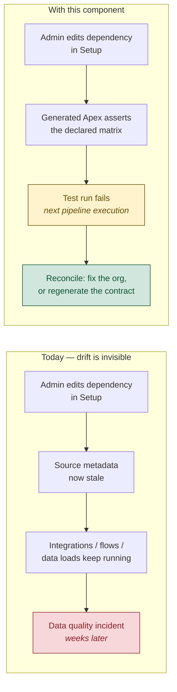

---

## 2. Design goals and non-goals

### Goals

| # | Goal | How it is met |
|---|---|---|
| G1 | Contract lives in source control, not in a spreadsheet | Specs are generated **Apex source files** committed to the repository |
| G2 | Drift is detected, not merely reported | Assertions run as an Apex test; the pipeline fails |
| G3 | The check must never pass vacuously | Empty registry is an explicit failure (`EMPTY` marker + `specRegistryIsNotEmpty` test) |
| G4 | Zero collision with customer Apex | Every emitted class is `SDT`-prefixed; framework classes live in their own directory |
| G5 | No callouts, no Remote Site, no Named Credential | Dependency data is read via `Schema` describe only |
| G6 | Tolerant of legitimate admin additions, intolerant of removals and drift | Paired `expectAtLeast` / `expectNotAllowed` per controlling value |
| G7 | A broken chain reports once, at its source | `dependsOn` + `UPSTREAM_FAILURE` short-circuit in the validator |

### Non-goals

| # | Non-goal | Rationale |
|---|---|---|
| N1 | Record-type-scoped assertions | `Schema` describe exposes no record-type-aware picklist values; a builder method that always fails is worse than no method. Explicitly documented in `SDTPicklistDependencySpec` |
| N2 | Repairing the org | The component reports drift. Remediation is a human decision — the org may be right and the source stale |
| N3 | Validating picklist *values* generally | Scope is the **dependency matrix**, not value sets, defaults, or inactive values |
| N4 | Acting as a data-access control | Nothing here enforces or evaluates FLS, sharing or record access. See [§9](#9-permissions-and-access-model) |

---

## 3. Architecture

Three tiers, two trust boundaries. The extension never touches the org directly — every org interaction is delegated to the authenticated Salesforce CLI.

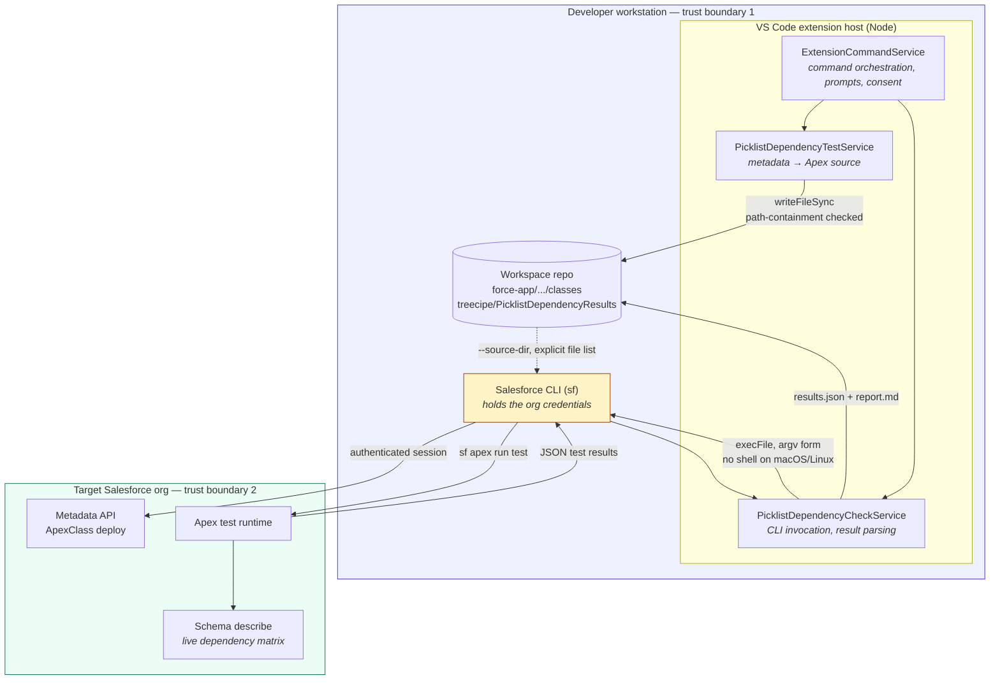

### Boundary contracts

| Boundary | What crosses it | Control |
|---|---|---|
| Repo XML → generator | Untrusted text (`<fullName>`, `<controllingField>`, value settings) from files that may originate from any branch or contributor | API-name regex allow-list `^[A-Za-z0-9_]+$`; Apex string-literal escaping for values |
| Generator → disk | Apex source and `-meta.xml` | `assertClassesDirectoryContainedInWorkspace` — symlink-resolved containment check before any write |
| Extension → CLI | Org identifier, file paths | `execFile` argv form (no shell) on macOS/Linux; org-identifier regex; explicit Windows quoting with double-quote rejection |
| CLI → org | Authenticated session | **Owned entirely by the Salesforce CLI.** The extension never reads, stores or transmits a token |
| Org → extension | Test results JSON | Parsed defensively; unknown shapes are treated as failure, never as pass |

**Credential posture:** this component holds no secrets. It has no configuration file containing credentials, performs no network I/O of its own, and delegates all authentication to `sf`, which the user has already authorised out of band. There is no code path in which an access token is read into the extension host.

---

## 4. Generated artefact catalogue

Two categories of Apex land in the customer's package directory. The distinction is deliberate and load-bearing for change control.

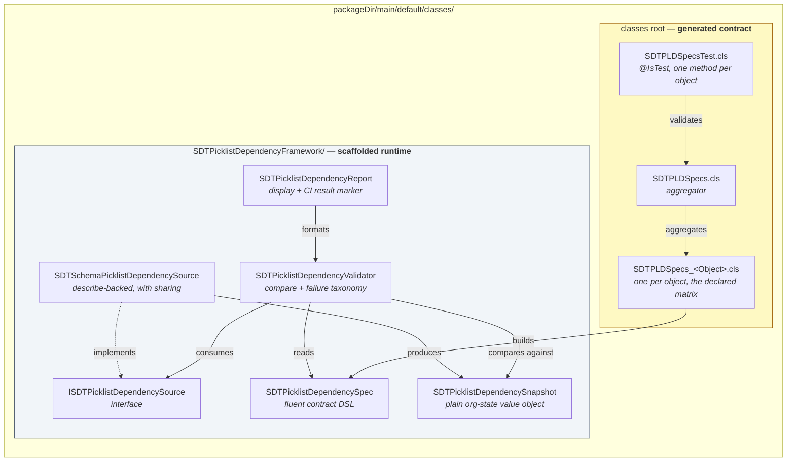

| Class | Category | Lifecycle | Sharing | Purpose |
|---|---|---|---|---|
| `ISDTPicklistDependencySource` | Framework | Scaffolded when absent; never overwritten | n/a (interface) | Boundary allowing the validator to be tested without an org |
| `SDTPicklistDependencySpec` | Framework | Scaffolded when absent | default | Fluent DSL: `forField().controlledBy().expectAtLeast()...` |
| `SDTPicklistDependencySnapshot` | Framework | Scaffolded when absent | default | ConnectApi-free value object describing org state; decodes `validFor` bit indexes |
| `SDTPicklistDependencyValidator` | Framework | Scaffolded when absent | default | Compares specs to snapshots; memoises; guards cycles; never throws on mismatch |
| `SDTSchemaPicklistDependencySource` | Framework | Scaffolded when absent | **`with sharing`** | Production source; `Schema` describe + `validFor` bitmap decode; per-transaction describe caches |
| `SDTPicklistDependencyReport` | Framework | Scaffolded when absent | default | Human report + `PICKLIST_DEPENDENCY_CHECK_RESULT=PASS\|FAIL\|EMPTY` marker |
| `SDTPLDSpecs_<Object>` | **Generated** | **Overwritten on every generation** | default | The declared matrix for one object, as executable Apex |
| `SDTPLDSpecs` | **Generated** | **Overwritten on every generation** | default | Aggregator; the only class downstream code should reference |
| `SDTPLDSpecsTest` | **Generated** | **Overwritten on every generation** | `@IsTest private` | One test method per object + `specRegistryIsNotEmpty` |

### Naming and collision policy

Every emitted class carries the `SDT` prefix — this is a hard project rule, not a convention. Two further constraints are enforced in code:

- **40-character `ApexClass` name limit.** `SDTPLDSpecs_<Object>` can exceed it for long object API names. The generator truncates and appends a 6-character SHA-256 digest of the object API name, preserving uniqueness deterministically (`buildPerObjectSpecsClassName`).
- **Apex identifiers cannot contain consecutive underscores.** Every `__c` in an API name is collapsed to `_` for method and class identifiers, with a `specFor_` / `object` prefix guarding names that would otherwise begin with a digit.

### Why a per-object class *and* an aggregator

An object appearing or disappearing from the metadata changes only which per-object class exists. `SDTPLDSpecs.all()` is the stable seam that every consumer — the generated test, any customer-written CI Apex — binds to. Without it, each metadata change would ripple into every caller.

---

## 5. Generation pipeline (XML → Apex)

Generation is **entirely local**. It requires no org, no authentication and no network. This is the single most important fact for the security review: the high-privilege operations ([§9](#9-permissions-and-access-model)) belong to the *check* command, not the *generate* command.

```mermaid
sequenceDiagram
    autonumber
    actor Dev as Developer
    participant Cmd as ExtensionCommandService
    participant Svc as PicklistDependencyTestService
    participant XML as XmlFileProcessor
    participant FS as Workspace filesystem

    Dev->>Cmd: "Generate Picklist Dependency Tests"
    Cmd->>Svc: collectSpecDetailsByObjectsDirectory(objectsUri)

    loop each objects/<Object>/fields/*.field-meta.xml
        Svc->>XML: processXmlFieldContent(xml, fileName)
        XML-->>Svc: XMLFieldDetail (type, controllingField, valueSettings)
    end

    Note over Svc: skip fields with no controllingField<br/>reject API names failing ^[A-Za-z0-9_]+$

    Svc->>Svc: buildControllingValueToPicklistOptions()
    Svc->>Svc: buildExpectations() — expectAtLeast + complement as expectNotAllowed
    Svc->>Svc: link dependsOn where the controlling field is itself dependent
    Svc->>Svc: buildPerObjectSpecsClassName() — 40-char cap, SHA-256 suffix

    Cmd->>Svc: assertClassesDirectoryContainedInWorkspace()
    Note right of Svc: symlink-resolved containment.<br/>A symlinked path segment aborts the write.

    Svc->>FS: write SDTPLDSpecs_<Object>.cls (+ -meta.xml)
    Svc->>FS: write SDTPLDSpecs.cls (+ -meta.xml)
    Svc->>FS: write SDTPLDSpecsTest.cls (+ -meta.xml)
    Svc->>FS: scaffold missing framework classes only
    Svc-->>Cmd: write result + legacy-artefact warnings
    Cmd-->>Dev: summary; offer to run the check
```

### The mapping rule

For one dependent field, for each controlling value, the generator emits **two** assertions:

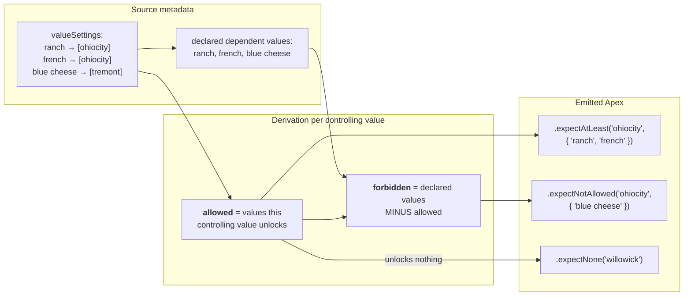

**Why the pair rather than `expectExactly`.** `expectExactly` fails when an administrator legitimately adds a new value to a combination — a change that is usually intended and should not break a pipeline. `expectAtLeast` alone fails to notice a value *drifting into* a combination it should not be in — a change that is usually a mistake and often a compliance problem. The complement pair catches removals **and** unintended additions while tolerating deliberate additions. `expectExactly` remains available as a **deliberate hand-tightening by the spec owner**, and — critically for change control — **that edit is lost on regeneration**. See [§11](#11-operational-governance).

---

## 6. Runtime design (how the assertion actually works)

### The `validFor` bitmap

Apex's `Schema.PicklistEntry` exposes **no** `getValidFor()` accessor. The dependency matrix is reachable only through an undocumented property of `JSON.serialize(entry)`, which emits a `validFor` key holding a base64-encoded bitmap. Set bits are indexes into the **controlling field's own `getPicklistValues()` order**.

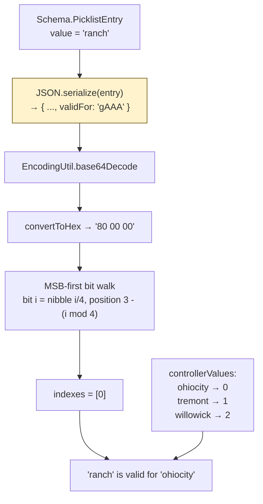

Three consequences follow, and each is handled explicitly in `SDTSchemaPicklistDependencySource`:

1. **The contract is undocumented and could change.** If the `validFor` key ever disappears for a field the org reports as dependent, the class throws a specific, loud exception rather than degrading into `MISSING_VALUES` on every spec — which would read to an operator as "an admin deleted all the dependencies". This is a deliberate fail-loud-not-wrong design choice.
2. **Checkbox controlling fields report no picklist values.** Their controlling values are supplied as `{ 'false', 'true' }` in that order. The order is not arbitrary — inverting it silently inverts every result for a checkbox-controlled picklist. Verified against a live org: bit 0 = `false`, bit 1 = `true`. Note the Metadata API spells these `checked`/`unchecked` in `valueSettings` while describe and the UI API key them `true`/`false`; **a spec must use `true`/`false`**.
3. **This replaced a ConnectApi-based design.** `ConnectApi.UiApi` does not exist in Apex (deploy fails outright), and the UI API is reachable only as a REST callout — which would require Remote Site or Named Credential configuration and **cannot run inside `@IsTest` at all**. Describe has neither constraint. This is why goal **G5** is achievable.

### Execution path

One entry point exists: the generated, **deployed** Apex test. Every run — the extension command, the demo harness, CI — deploys `SDTPLDSpecsTest` alongside the specs and executes it with `sf apex run test`. There is deliberately no anonymous-Apex variant: a check that runs from deployed Apex always executes in system context, so its result cannot vary with the running user ([§9](#9-permissions-and-access-model)).

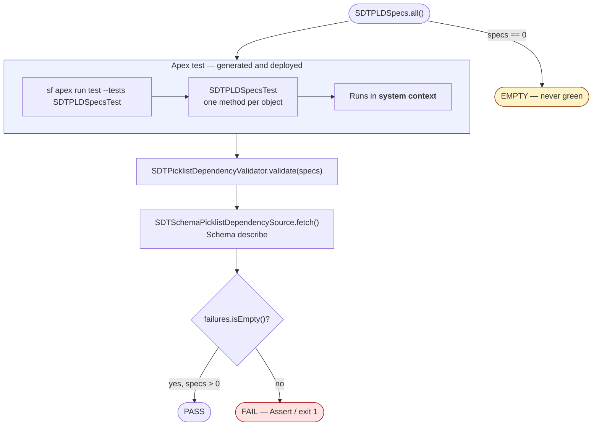

**Why `@IsTest` works here.** `Schema` describe is not isolated by `@IsTest`. No `@TestSetup` data, no `SeeAllData`, no records are involved — the describe calls return the org's real metadata inside a test transaction exactly as they would outside one. This is what makes a *test* a legitimate vehicle for a *metadata* assertion.

---

## 7. Validation semantics and failure taxonomy

The validator's contract: **it never throws on a mismatch.** A single unreachable or malformed spec must not hide the results of every other spec. Source exceptions are caught per spec and recorded as `LOOKUP_ERROR`; validation continues.

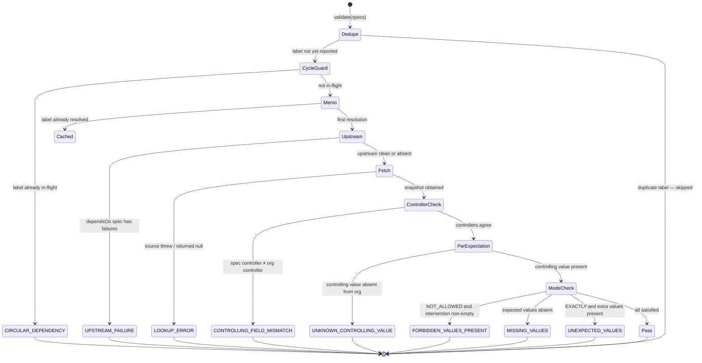

| Failure kind | Meaning | Typical cause | Operator action |
|---|---|---|---|
| `MISSING_VALUES` | A value the contract requires is no longer unlocked | Admin removed a combination | Reconcile: fix org, or regenerate |
| `UNEXPECTED_VALUES` | `expectExactly` line sees extra values | Admin added a value to a tightened combination | Deliberate tightening was violated — review |
| `FORBIDDEN_VALUES_PRESENT` | A value drifted **into** a combination | Misconfigured `valueSettings` | Almost always an org defect |
| `UNKNOWN_CONTROLLING_VALUE` | Controlling value absent from the org | Value renamed or deactivated | High blast radius — investigate first |
| `CONTROLLING_FIELD_MISMATCH` | Org reports a different controlling field | Dependency **rewired** | The most serious drift; the field's whole matrix is now unverified |
| `UPSTREAM_FAILURE` | Controlling field's own spec failed | Chained dependency broken upstream | Fix the named upstream spec first |
| `CIRCULAR_DEPENDENCY` | `dependsOn` chain loops | Hand-edited spec | Salesforce cannot express this — the spec file is wrong |
| `LOOKUP_ERROR` | Source threw | Field missing, not dependent, or `validFor` contract changed | Read the message; it distinguishes these |

### Chained dependencies

Where a controlling field is itself a dependent picklist (`City__c` → `Neighborhood__c` → `Dressing__c`), the generator links the specs with `dependsOn`. The validator resolves upstream first and **short-circuits**: a broken `Neighborhood__c` produces one failure at its source plus one `UPSTREAM_FAILURE` per downstream spec, rather than the same describe mismatch repeated N times, which would bury the one fact that matters.

Upstream specs are resolved **on demand** rather than required in the caller's list — a chain can cross objects while the generated test validates one object at a time. Results are memoised per spec label, so a controlling field shared by several dependent picklists costs one describe, not one per dependent.

---

## 8. Security design

### Threat model

Assets: the customer's Salesforce org, the customer's repository, and the developer workstation. Adversaries considered: a malicious or compromised **repository contributor** (can control the XML the generator reads), and a malicious **package/branch** (can control filesystem layout).

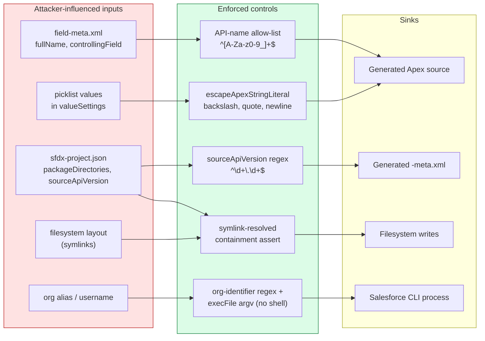

### Control inventory

| # | Surface | Threat | Control | Location |
|---|---|---|---|---|
| S1 | Apex **code** injection via API names | A crafted `<fullName>` closing a string literal and appending Apex that ships to the org | Allow-list `^[A-Za-z0-9_]+$` on object, field and controlling-field names; a violation aborts generation for that field | `isValidSalesforceApiName` |
| S2 | Apex **literal** injection via picklist values | Values are free text and cannot be allow-listed | `escapeApexStringLiteral` escapes `\`, `'`, and normalises CR/LF to `\n` — values remain data | `escapeApexStringLiteral` |
| S3 | XML injection into `-meta.xml` | Arbitrary `sourceApiVersion` written into generated XML | Strict `^\d+\.\d+$`; anything else falls back to the default `64.0` | `getSourceApiVersion` |
| S4 | Path traversal / symlink write | A repo steering generated files (whose content is partly attacker-influenced) outside the workspace | `assertClassesDirectoryContainedInWorkspace` resolves symlinks on both sides and requires a trailing-separator-anchored prefix match; called at point of use, not inside the write helpers | `isPathContainedInWorkspace` |
| S5 | Command injection into the CLI | A crafted alias reaching a shell | `execFile` argv form with **no shell** on macOS/Linux; identifier regex rejects a leading `-` so a value can never be read as a flag | `assertValidTargetOrgIdentifier`, `buildSalesforceCliInvocation` |
| S6 | Windows shell exposure | Windows requires `shell: true` because `sf` ships as a `.cmd` shim (post-CVE-2024-27980 Node cannot spawn it otherwise) | Every argument is double-quoted; an argument containing `"` is **rejected**, not escaped — cmd.exe escaping is not attempted | `quoteWindowsArgument` |
| S7 | Over-broad deployment | A convenience deploy carrying unrelated work-in-progress Apex into the org | Classes are named **individually** with repeated `--source-dir`; the whole `classes` directory is never deployed | `getPicklistDependencyClassFilePaths` |
| S8 | Silent overwrite of org state | Forcing past a source-tracking conflict | `SourceConflictError` is surfaced as a stop with instructions; `--ignore-conflicts` is **never** passed automatically | `deployPicklistDependencyClasses` |
| S9 | Duplicate component in a deployment | Framework class present both loose and scaffolded (upgraded workspace) | First hit wins per class; no class is ever sent under two paths | `getPicklistDependencyClassFilePaths` |
| S10 | Vacuous pass | An empty registry reporting green | `EMPTY` result marker + `specRegistryIsNotEmpty` test method | `SDTPicklistDependencyReport`, generated test |
| S11 | UI thread starvation | Synchronous spawn freezing the shared extension host | All CLI invocations are async with cancellation registration | `runSalesforceCli` |

### Data classification

The component writes three things to disk. None are secrets; all warrant a classification decision by the CoE:

| Artefact | Contents | Classification consideration |
|---|---|---|
| `SDTPLDSpecs_<Object>.cls` | Object API names, field API names, **picklist value API names** | Business metadata. Committed to source control by design. Picklist values can encode commercially sensitive taxonomies (pricing tiers, risk grades, customer segments). **Confirm your repository's visibility is appropriate before the first commit.** |
| `treecipe/PicklistDependencyResults/*/results.json` | Target org identifier (alias **or username, which is an email address**), timestamp, method names, pass/fail | Contains a username when no alias is set. **Recommend adding this folder to `.gitignore` unless the CoE wants run history committed.** |
| `.../report.md` | Same, plus full failure messages including org-reported picklist values | Same as above, with more business metadata in failure detail |

**Consent model.** No deploy occurs without an explicit confirmation dialog that names every file to be sent (`buildDeployConfirmationMessage`). The org is selected from the CLI's already-authorised orgs via an explicit prompt — never inferred from a default target.

---

## 9. Permissions and access model

This is the section a security review should read most closely. The two commands sit at **very different** privilege levels.

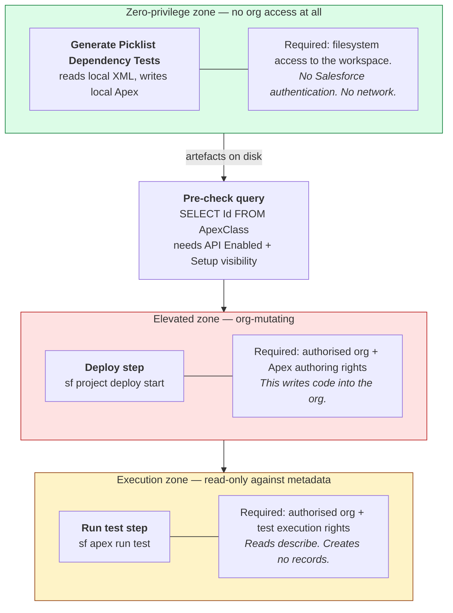

### 9.1 Required permissions by operation

| Operation | Performed by | Permission required | Notes |
|---|---|---|---|
| Generate specs | Extension (local) | **None on the platform.** Filesystem write to the workspace only | Safe to run in any environment, including one with no org connection |
| List authorised orgs | `sf` CLI | None — reads the local CLI auth store | The extension surfaces only orgs the user has already authorised |
| Query `ApexClass` (deploy-needed check) | `sf data query` | **API Enabled**; read access to the `ApexClass` tooling/standard object, which in practice accompanies **View Setup and Configuration** **[verify-in-org]** | A failure is treated as "not deployed" — the design prefers a redundant prompt over a skipped deploy |
| Deploy the classes | `sf project deploy start` | **API Enabled** + **Author Apex** **[verify-in-org]** | Author Apex is the governing permission for creating/updating `ApexClass` via the Metadata API |
| Run the test class | `sf apex run test` | **API Enabled** + Apex test execution rights, conventionally granted with **Author Apex** **[verify-in-org]** | Creates no records; reads describe only |

> **[verify-in-org]** The precise permission names above reflect standard Salesforce practice, but permission-to-operation mappings change between releases and are affected by org-specific permission sets. Confirm each against your own org and your current API version before writing them into a policy document. [§12](#12-verification-checklist) gives a procedure.

### 9.2 Execution context — the part that surprises people

| Path | Context | CRUD/FLS enforced? | Implication |
|---|---|---|---|
| `SDTPLDSpecsTest` via `sf apex run test` | **System context** (Apex tests run in system mode absent an explicit `System.runAs`) | **No** | Describe returns the full field set regardless of the running user's field-level security. The assertion result does **not** vary by who runs it. This is what makes the check a reliable, reproducible gate |

Running the check as **anonymous Apex** (`sf apex run -f`) would execute as the authenticated user, against that user's object and field permissions — a user lacking visibility on a field could see a different, and misleading, result. This is the design reason the check runs **only** from generated Apex that has been deployed to the target environment; no anonymous-Apex entry point ships.

`SDTSchemaPicklistDependencySource` is declared `with sharing`. This is defensive hygiene, not a functional control: **sharing rules govern record access and have no bearing on `Schema` describe**, which reads metadata. No records are queried anywhere in this component.

### 9.3 What does **not** grant access, and what may falsely appear to

A CoE granting rights for this component should understand the negative space as clearly as the positive:

| Assumption | Reality |
|---|---|
| "Read access to the object is enough to run the check" | **No.** The check does not read records. It needs the ability to *deploy and run Apex*, which is a far higher privilege than reading the object |
| "The check will respect the running user's field-level security" | **Not on the test path.** Apex tests run in system context, so FLS does not filter describe. Do not treat this component as evidence of what a given user can see |
| "`with sharing` on the source class limits what it can read" | **No.** Sharing governs records, not metadata describe. It is present as hygiene |
| "Granting Author Apex just for this check is low risk" | **No.** Author Apex permits creating and modifying arbitrary Apex in the org. This is one of the highest-privilege permissions on the platform. In production it should be granted to a controlled CI identity, time-boxed, and audited — not to individual developers as a convenience |
| "It can run in production like it does in a sandbox" | **Verify first.** Deploying Apex to production has additional test-execution requirements, and the check service currently passes **no `--test-level` argument**. See risk **R1** in [§13](#13-risks-and-open-items) |
| "A field the user cannot see will be quietly skipped" | The source's error text states that an invisible field is "absent from describe entirely". **That statement is questionable** — `fields.getMap()` generally returns fields irrespective of FLS, with accessibility exposed via `isAccessible()`. See risk **R3** |

### 9.4 Recommended access pattern

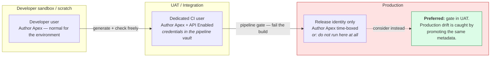

**Recommendation:** treat the production run as optional. The value of the gate is highest in the environment where the metadata is promoted *from*. If production drift detection is genuinely required, prefer the read-only posture: deploy the classes once through the normal release process, then run only the test — never grant standing deploy rights for this component.

---

## 10. Performance and governor budget

The validator runs **every spec in one transaction**. All per-spec work is therefore multiplied by the spec count against a shared **10,000 ms CPU** and **6 MB heap** budget. There is **no SOQL and there are no callouts**, which leaves CPU as the binding limit.

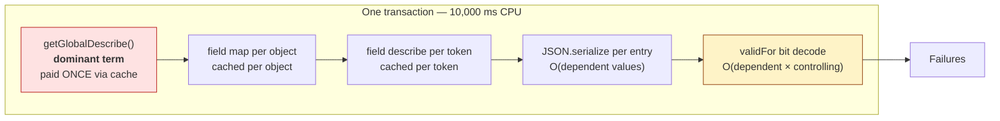

### Measured figures (scratch org, describe resolution alone, each timed in its own transaction)

| Workload | Uncached | Cached | Note |
|---|---|---|---|
| 63 distinct fields on one object | ~827 ms | ~25 ms | The realistic case — one spec per dependent field |
| The same field 100 times | ~1,130 ms | ~70 ms | Not a shape a well-formed registry produces |
| Heap, one object with field describes retained | ~43 KB | — | **Per object**; does not generalise |

Caching returns roughly a tenth of the whole transaction budget on the realistic workload, and the distinct-field case benefits *more* than the repeated-field case because `getGlobalDescribe()` is the dominant term and is paid once rather than per spec.

### Cache design decisions worth recording

- **`DESCRIBES_BY_TOKEN` is keyed on the `Schema.SObjectField` token, not `"Object.Field"`.** A controlling field is reached via `getController()`, which yields a token and no name — naming it would require the very `getDescribe()` call the cache exists to avoid. Token keying covers both the dependent and controlling paths with one map and dedupes for free when one spec's controlling field is another spec's dependent field.
- **Object keys are lower-cased.** Apex `Map<String, …>` compares case-sensitively while describe resolves case-insensitively; without normalisation, `'account'` and `'Account'` would each hold a duplicate field map.
- **The assembled snapshot is deliberately *not* memoised** by object/field. A well-formed registry has one spec per (object, field), so duplicate resolution is redundant by construction; a snapshot cache would add staleness surface and retained heap for a workload the design does not produce.
- **`JSON.serialize` is per entry, not batched.** Batching was measured and rejected — ~500 ms either way for 100 specs × 32 entries, because JSON cost tracks bytes rather than call count. Batching bought only a positional-alignment failure mode. Measure in a **fresh** transaction if revisiting; successive blocks within one transaction each run slower than the last regardless of content.

### Scaling caveats — the CoE's watch items

| Watch item | Threshold | Consequence |
|---|---|---|
| **Distinct objects** in the registry | `FIELD_MAPS_BY_OBJECT` grows monotonically with distinct objects | Trades CPU for heap against the 6 MB limit. **Revisit if a registry spans dozens of objects** |
| **Controlling picklist width** | Decode is O(dependent × controlling) | Overtakes JSON cost as the controlling picklist grows |
| **Total spec count in one transaction** | All specs share one 10,000 ms budget | The per-object test methods mitigate this: each method validates one object, in its own transaction. Customer-written Apex that calls `SDTPLDSpecs.all()` and validates everything in one transaction is the more likely place to hit the ceiling |
| **Cache and `System.runAs`** | Statics are per-transaction and cannot go stale from an admin edit or leak between users in production | **Exception:** `System.runAs` switches user *within* a test transaction. A future FLS-variant test must call `clearCaches()` between `runAs` blocks or it will assert against the previous user's describe and **pass falsely** |

### Extension-host performance

Every CLI invocation is asynchronous. The VS Code extension host is single-threaded and shared by every installed extension, so a synchronous spawn would freeze the entire window — and these operations are long-running by nature (a deploy and a test run each wait on org-side queues). Waits are explicitly bounded at **10 minutes** for both deploy and test run, overriding the CLI's 33-minute default, and cancellation is wired through to child-process termination.

---

## 11. Operational governance

### Ownership of generated files

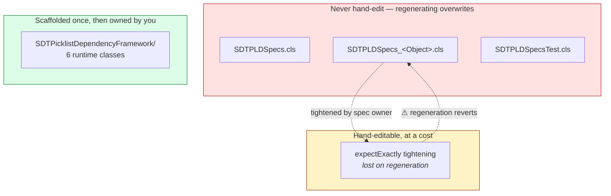

Each generated file carries a `GENERATED FILE -- regenerating overwrites it` header. The framework classes are scaffolded **only when absent**, so a workspace carrying its own modified copy keeps it — which is why the deploy confirmation names every file: the user must be able to see which copy is about to be sent.

### Recommended controls

| Control | Recommendation |
|---|---|
| **Code review** | Treat a diff in `SDTPLDSpecs_*.cls` as a **business-rule change**, not a code change. It should be reviewed by whoever owns the picklist taxonomy, not only by an engineer |
| **CODEOWNERS** | Assign `**/SDTPLDSpecs*.cls` to the data-governance reviewer group |
| **Regeneration discipline** | Regenerate in the same commit as the metadata change that motivated it. A spec file drifting from its `field-meta.xml` defeats the purpose |
| **`expectExactly` register** | Maintain a short list of deliberately-tightened combinations, since regeneration silently reverts them. Consider a CI check that fails if a registered tightening is missing |
| **CI placement** | Run the check on every deployment to a shared environment, after deploy, before the promotion gate |
| **Result artefacts** | Decide explicitly whether `treecipe/PicklistDependencyResults/` is committed. If committed, apply a retention policy; if not, add it to `.gitignore` |
| **Empty registry** | Never suppress the `EMPTY` verdict. A green check that verified nothing is worse than no check |
| **Legacy artefacts** | The generator warns about artefacts from earlier, non-`SDT`-prefixed versions. Remove them — an orphaned old class can still deploy and confuse the picture |

### CI integration contract

CI runs the same path as everything else: deploy the generated classes, then `sf apex run test --tests SDTPLDSpecsTest` and gate on the test outcome. For pipelines that read the report output, `SDTPicklistDependencyReport` emits a single stable line:

```
PICKLIST_DEPENDENCY_CHECK_RESULT=PASS | FAIL | EMPTY
```

`EMPTY` must be treated as failure. Any pipeline consuming this component should assert on the test result or the marker rather than on log text, which is not a stable contract.

---

## 12. Verification checklist

A reviewer should not approve this design on the document alone. Confirm each item in your own org:

- [ ] **Permission mapping.** In a sandbox, create a user with `API Enabled` only. Attempt `sf project deploy start` and `sf apex run test`. Record which permission each step actually demands, and update [§9.1](#91-required-permissions-by-operation) with the observed answer for your API version.
- [ ] **Production deploy path.** Attempt the deploy against a production-like org and confirm whether the absence of `--test-level` blocks it (risk **R1**).
- [ ] **FLS and describe.** Confirm whether a field hidden by FLS is genuinely absent from `fields.getMap()`, or merely reports `isAccessible() == false` (risk **R3**).
- [ ] **`validFor` contract.** Confirm the serialization still emits `validFor` at your API version, including for a checkbox-controlled picklist, and that bit 0 is `false`.
- [ ] **Governor headroom.** Run the check against your largest object set and record actual CPU and heap consumption against the 10,000 ms / 6 MB budget.
- [ ] **Data classification.** Review a generated `SDTPLDSpecs_*.cls` and a `results.json` against your repository visibility and data-handling policy ([§8](#security-design), Data classification).
- [ ] **Deploy scope.** Confirm from a real deploy's component list that only `SDT`-prefixed classes were sent.

---

## 13. Risks and open items

| ID | Risk | Severity | Detail | Suggested action |
|---|---|---|---|---|
| **R1** | No `--test-level` on deploy | **Medium** | `deployPicklistDependencyClasses` builds `sf project deploy start` with `--source-dir`, `--target-org`, `--wait`, `--json` and no test level. Production deployments of Apex have test-execution requirements the CLI default may not satisfy | Verify against production; if it fails, add an explicit test level and surface it in the confirmation dialog |
| **R2** | `Author Apex` is a high-privilege grant | **Medium** | Running the check in production requires rights to author arbitrary Apex | Prefer the UAT gate ([§9.4](#94-recommended-access-pattern)); if production is required, use a time-boxed release identity |
| **R3** | Misleading FLS error text | **Low** | `describeField` tells the operator an invisible field is "absent from describe entirely". Describe generally returns fields regardless of FLS, exposing accessibility via `isAccessible()` | Verify, then correct the message so an operator is not sent to investigate a permissions problem that does not exist |
| **R4** | Undocumented `validFor` contract | **Medium** | The entire mechanism rests on a JSON serialization behaviour Salesforce does not document | Already mitigated by the loud, specific exception. Add the contract to the release-regression checklist for each API version bump |
| **R5** | Result artefacts may contain a username | **Low** | When no alias is set, `results.json` records the username (an email address) | Prefer aliases; decide the `.gitignore` posture explicitly |
| **R6** | `expectExactly` tightenings are silently reverted | **Low** | Regeneration overwrites the generated classes wholesale | Maintain the tightening register and consider a CI assertion ([§11](#11-operational-governance)) |
| **R7** | Heap growth across many objects | **Low** | `FIELD_MAPS_BY_OBJECT` grows with distinct objects; ~43 KB per object is not a general figure | Measure before extending the registry to dozens of objects; consider batching by object |
| **R8** | Record-type scoping unsupported | **Accepted** | Describe exposes no record-type-aware picklist values (**N1**) | Document the limitation for admins who assume record-type filtering is covered |
| **R9** | Stray `undefined/` output directory in the working tree | **Low** | The repository currently contains `undefined/treecipe/GeneratedRecipes/...`, indicating a code path that interpolated an undefined workspace path | Unrelated to this component's Apex, but should be traced and removed before release |

---

## Appendix A — Source of truth

Every statement about behaviour in this document is drawn from the following files on `claude/picklist-spec-generation-2sdlrs`:

| Concern | File |
|---|---|
| Command orchestration, consent | [`ExtensionCommandService.ts`](../src/treecipe/src/ExtensionCommandService/ExtensionCommandService.ts) |
| Metadata → Apex generation | [`PicklistDependencyTestService.ts`](../src/treecipe/src/PicklistDependencyTestService/PicklistDependencyTestService.ts) |
| CLI invocation, deploy, results | [`PicklistDependencyCheckService.ts`](../src/treecipe/src/PicklistDependencyCheckService/PicklistDependencyCheckService.ts) |
| Contract DSL | [`SDTPicklistDependencySpec.cls`](../force-app/main/default/classes/SDTPicklistDependencyFramework/SDTPicklistDependencySpec.cls) |
| Comparison + failure taxonomy | [`SDTPicklistDependencyValidator.cls`](../force-app/main/default/classes/SDTPicklistDependencyFramework/SDTPicklistDependencyValidator.cls) |
| Describe source, caching, bit decode | [`SDTSchemaPicklistDependencySource.cls`](../force-app/main/default/classes/SDTPicklistDependencyFramework/SDTSchemaPicklistDependencySource.cls) |
| Org-state value object | [`SDTPicklistDependencySnapshot.cls`](../force-app/main/default/classes/SDTPicklistDependencyFramework/SDTPicklistDependencySnapshot.cls) |
| Reporting + CI marker | [`SDTPicklistDependencyReport.cls`](../force-app/main/default/classes/SDTPicklistDependencyFramework/SDTPicklistDependencyReport.cls) |
| Worked example of generated output | [`SDTPLDSpecs_Treecipe_Demo_c.cls`](../force-app/main/default/classes/SDTPLDSpecs_Treecipe_Demo_c.cls) |
