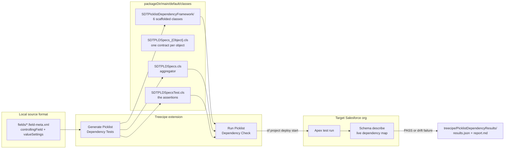
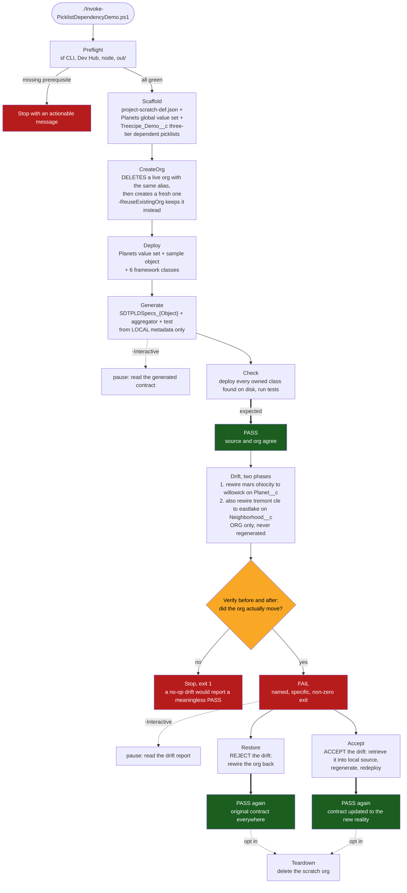
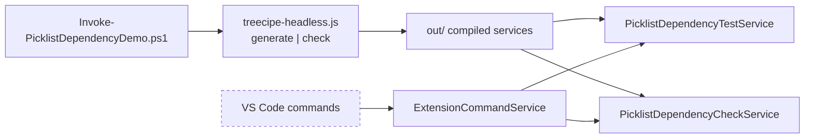
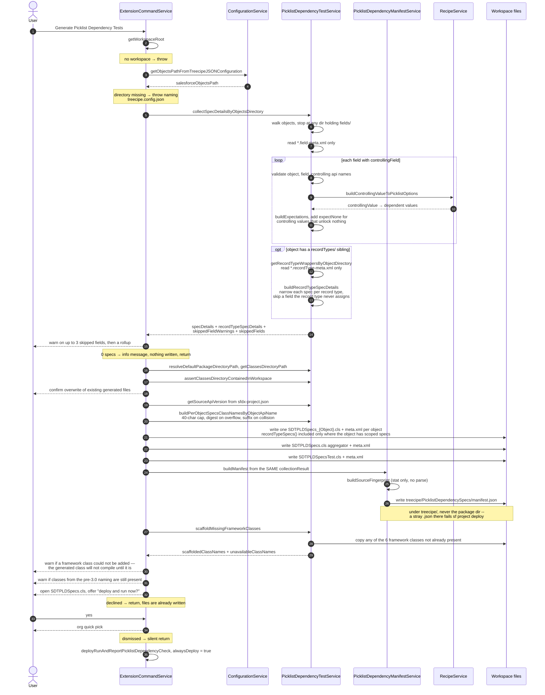
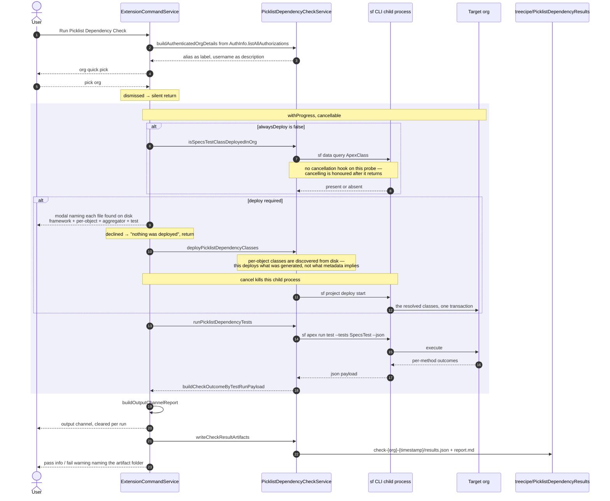
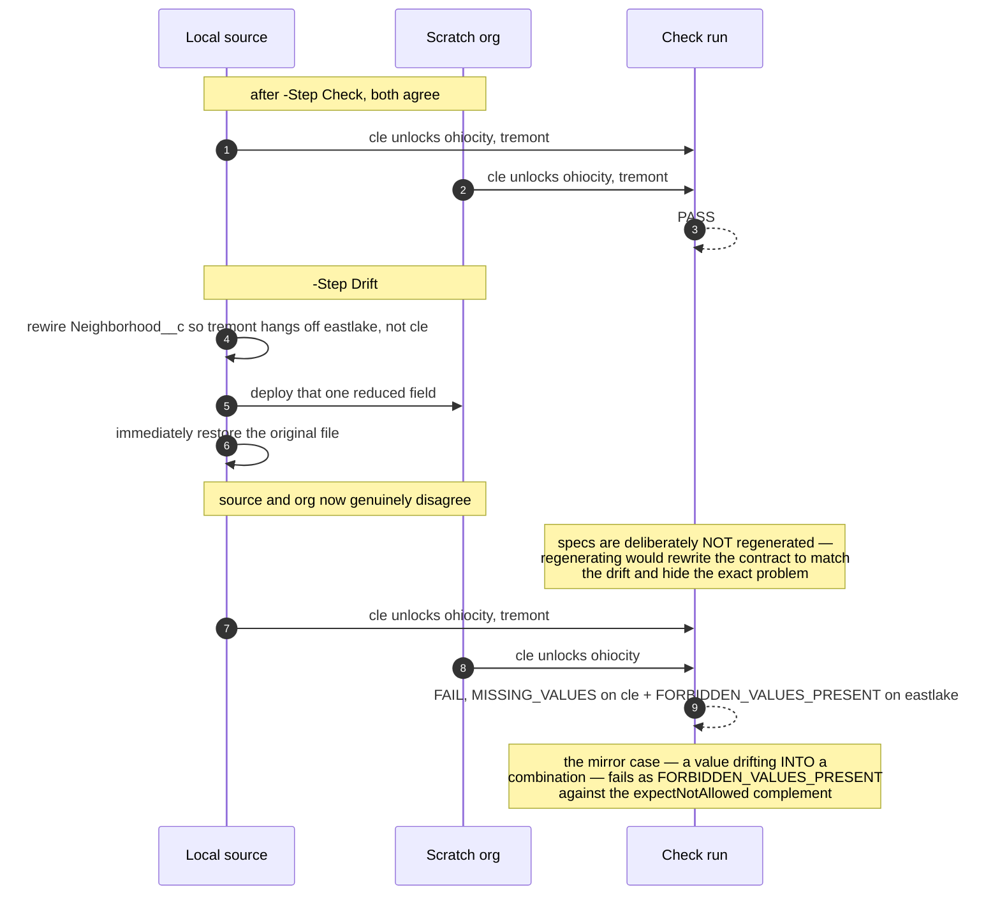
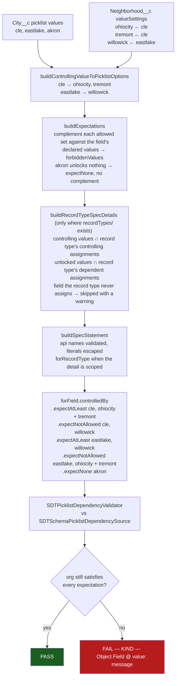
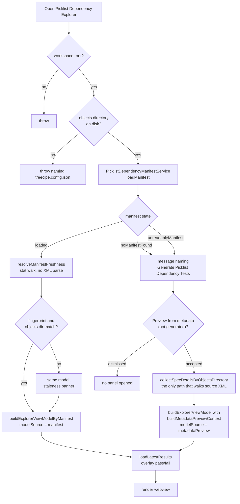
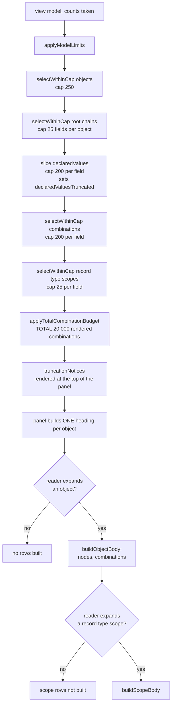

# Picklist Dependency Testing — Flow Diagrams

Visual companion to [`README.md`](./README.md). That file is the runbook — what to type and what to
expect. This file is the map — what actually moves, in what order, and where each step can stop.

Every diagram below is drawn from shipped code, not from intent:
`ExtensionCommandService`, `PicklistDependencyTestService`, `PicklistDependencyCheckService`,
and `Invoke-PicklistDependencyDemo.ps1`.

| Diagram | Answers |
|---|---|
| [1. The contract loop](#1-the-contract-loop) | What is the feature, in one picture |
| [2. Demo script step machine](#2-demo-script-step-machine) | What each `-Step` does and what gates it |
| [3. Generate command](#3-generate-picklist-dependency-tests) | What happens on generate, including every early exit |
| [4. Run check command](#4-run-picklist-dependency-check) | Deploy-or-skip, cancellation, artifacts |
| [5. The deployment set](#5-the-deployment-set) | Why the framework, the aggregator and every per-object class ship in one transaction |
| [6. Drift detection](#6-drift-detection-the-step-that-proves-it) | How a rewired org gets caught |
| [7. Metadata to assertion](#7-metadata-to-assertion) | XML → Apex → verdict, value by value |
| [8. Explorer open path](#8-explorer-open-path) | How the panel decides what it is allowed to claim |

---

## 1. The contract loop

Source metadata is the contract. The org is the thing under test. The generated Apex is the bridge.



The point of the loop: that map already existed inside Treecipe to drive recipe generation, and used
to die at YAML-write time. Turning it into Apex makes it executable, so an admin rewiring the
dependency later fails a test instead of surfacing as a confusing Collections API error at data load.

---

## 2. Demo script step machine

`./Invoke-PicklistDependencyDemo.ps1 -Step <Step>`. `All` runs `Preflight` → `Check` and stops.
`FullRun` runs the whole contract lifecycle in one invocation. `Drift`, `Restore`, `Accept` and
`Teardown` are opt-in individually because they mutate or destroy the org.



`FullRun` chains `Preflight` → `Check` → `Drift` → `Accept`, so one invocation proves the contract
passes, catches the org moving, and comes back into agreement.

**`Verify` is the step underneath the guard.** It reads the live controlling-value map through
`SDTSchemaPicklistDependencySource`, the same source the check uses, and answers the one question a
deploy result cannot: what does the org actually hold. `Drift` calls it either side of its own deploy
and refuses to continue unless the org genuinely moved — a deploy reporting `Succeeded` says only
that the payload was accepted.

**Deploys pass `--ignore-conflicts`.** The script authored every file it deploys, so local is
authoritative by construction, and `Accept` creates a source-tracking conflict by design when it
retrieves. This is correct for a harness that owns its own metadata; it is not advice for deploying
a real project.

`Deploy` is not optional even though generation reads nothing from the org: the Apex test resolves
`Treecipe_Demo__c.Neighborhood__c` through Schema describe, so the fields must exist in the org or
every method fails with `LOOKUP_ERROR`.

The script drives the same compiled services the VS Code commands drive, through
`treecipe-headless.js` — the commands themselves cannot be invoked outside an extension host.



---

## 3. Generate Picklist Dependency Tests

`treecipe.generatePicklistDependencyTests` → `ExtensionCommandService.generatePicklistDependencyTests`.
Generation reads local source metadata — a `readDirectory` per directory and a `readFile` plus xml2js
parse per `*.field-meta.xml`, scaling with the size of the objects tree. It writes the Apex classes
and the spec manifest that describes them, both from one in-memory model in one run.
It never reads the org: org contact happens only if you accept the deploy prompt at the end.



That final call always deploys: the classes were just rewritten, so the org copy is stale by
definition and a conditional deploy would run yesterday's contract against today's metadata.

---

## 4. Run Picklist Dependency Check

`treecipe.runPicklistDependencyCheck`. Same shared helper as the tail of generate, with
`alwaysDeploy = false`.



The output channel is cleared on every invocation, so the artifact folder is what survives —
committable, diffable between runs, attachable to a review. Passing runs are written too: a green
check belongs on record, not just a failing one.

---

## 5. The deployment set

The framework, the aggregator, the test and one class per object — all in one transaction. Not a
convention, a compile requirement.


Salesforce resolves `ApexClass` by the enclosing `classes` directory and walks nested folders, so the
subdirectory deploys identically to a flat layout. The split is for humans: the framework is
replaceable boilerplate you can delete in one action; the generated files are the contract you
actually engage with. Workspaces generated by an earlier version keep the framework loose at the
classes root — both layouts work, and each class is resolved from one path only, since Salesforce
rejects the same `ApexClass` twice in one deployment.

The count is deliberately not stated as a number here. It is `6 + N + 2` — six framework classes, one
per object with a dependent picklist, plus the aggregator and its test — so it moves with the
metadata. `getPicklistDependencyClassFilePaths` discovers the per-object classes **from disk** rather
than re-deriving them from metadata, because this command deploys what was generated; re-deriving
would silently disagree with it whenever the metadata changed after the last generation.

Generated class names must also fit Salesforce's 40-character `ApexClass.Name` cap. An object api
name long enough to breach it is truncated and given a six-character digest of the *full* api name —
stable across runs, where a positional suffix would orphan the previously generated class in the org.

Upgrading from 2.12.x–2.14.x leaves the pre-3.0 classes (`SFTreecipePicklistDependencySpecs` and the
old `PicklistDependencyFramework/`) in the workspace. Generation warns about them rather than
deleting them, so you are told what to remove instead of ending up with two frameworks side by side.

---

## 6. Drift detection, the step that proves it

A check that only ever passes proves nothing.



The failure names the object, the field, the controlling value, and the specific missing value:

```
FAIL  Treecipe_Demo_c_picklistDependenciesMatchSourceMetadata
      System.AssertException: Assertion Failed: Picklist dependency drift on Treecipe_Demo__c
      -- 1 combination(s) no longer match local source metadata:
        - MISSING_VALUES — Treecipe_Demo__c.Neighborhood__c @ cle: Expected values no longer valid: [tremont]
```

The method name is `Treecipe_Demo_c_...`, not `Treecipe_Demo__c_...`: Apex identifiers may not
contain two consecutive underscores, so runs of underscores in the object api name are collapsed by
`buildTestMethodNameByObjectApiName`. The api name itself reaches the assertion as a string literal
and keeps its exact `__c` suffix, so the describe still resolves the real object.

`MISSING_VALUES` is one of several kinds `SDTPicklistDependencyValidator.FailureKind` can report.
The others carry their own meaning: `FORBIDDEN_VALUES_PRESENT` for a value that drifted into a
combination it does not belong in, `UPSTREAM_FAILURE` for a link whose controlling field already
failed further up a chain, `CIRCULAR_DEPENDENCY`, `CONTROLLING_FIELD_MISMATCH`,
`UNKNOWN_CONTROLLING_VALUE`, `UNEXPECTED_VALUES`, and `LOOKUP_ERROR` when a field cannot be resolved
at all — that last one is reported per spec rather than aborting, so the remaining specs still run.

> **A dependency cannot be broken by omission.** Salesforce merges `valueSettings` on a `CustomField`
> deploy, so an entry left out of the payload is not removed from the org and the deploy still
> reports `Succeeded`. Drift must therefore *rewire* a value from one controlling value to another,
> which is also what an admin does in Setup. Rewiring is the stronger assertion anyway: it fires
> `MISSING_VALUES` on the old controlling value and `FORBIDDEN_VALUES_PRESENT` on the new one.

---

## 7. Metadata to assertion

One dependent field, end to end.



Every combination is now asserted twice. `expectAtLeast` says which values a controlling value must
still unlock; `expectNotAllowed` says which it must not. The pair catches a value going missing *and*
a value drifting into the wrong bucket — the positive assertion alone only ever caught the first.

The complement is deliberately not `expectExactly`. Switching the generator to an exact match would
be the obvious move and is wrong: it fires on any value an admin legitimately adds to the field after
generation. The complement tolerates that while still failing on a value in the wrong bucket. Its
universe comes from the field's own declared values rather than its `valueSettings` map, so a value
with no `valueSettings` entry at all — unreachable under every controlling value — falls into every
complement naturally. A controlling value that unlocks nothing gets no complement: `expectNone`
already asserts that.

A chained dependency (`Country__c` → `State__c` → `City__c` → `District__c`) emits `dependsOn` naming
the upstream spec's own generated method, so a break upstream is reported once at its source and each
link below it gets a single `UPSTREAM_FAILURE` naming its **immediate** upstream, instead of repeating
the same describe mismatch all the way down. The link is emitted only where the controlling field is
itself dependent, so a chain of three dependency links gives two `dependsOn` calls — the root of the
graph has nothing above it.

A dependent picklist whose values come from a **global value set** is captured the same way. Such a
field has no local `valueSetDefinition` — only the value *definitions* live elsewhere — but its
`controllingField` and `valueSettings` are in the field file like any other, so the dependency map is
built from `valueSettings` directly and the field gets the same `expectAtLeast` / `expectNotAllowed`
pair and the same `dependsOn` link. Its complement's universe comes from the **global value set
itself**, read through the `GlobalValueSetSingleton` that recipe generation already populates, so a
set value with no `valueSettings` entry — unlocked by no controlling value — lands in every complement
just as a locally declared one does. A field references its set by full name while the only name
inside the set file is its `masterLabel`, so the singleton registers each set under both.

Where that set cannot be read, the field is skipped with a warning naming it rather than specced
against an empty universe; where a `valueSettings` entry names a value the set does not declare, that
value is dropped and reported, and a controlling value left unlocking nothing becomes `expectNone`.

A field with a `controllingField` but no `valueSettings` markup is reported and skipped rather than
aborting the run, as is a field whose object, field, or controlling api name is not a plain
Salesforce identifier.

---

## What the diagrams cannot cover

The VS Code UI layer has no automated coverage **beyond unit tests against a mocked `vscode`** —
`ExtensionCommandService.test.ts` does cover the command paths, including cancellation, the empty-org
case and report display, but against a mock rather than a running extension host, and the demo script
drives the compiled services rather than the host either. What no automated test observes is the real
UI: that the quick pick shows alias and username as it should, that the progress notification actually
renders a Cancel button, that the deploy modal is modal, and that the output channel opens and indents
multi-line assertion messages. The manual checklist in
[`README.md`](./README.md#testing-through-the-vs-code-ui-instead) is what covers those.

---

## 8. Explorer open path

`treecipe.openPicklistDependencyExplorer` → `ExtensionCommandService.openPicklistDependencyExplorer`.

The panel's central promise is that what it renders is what the generated tests assert. That is only
true when it renders the manifest, so the manifest is read first and the metadata scan is reachable
only as an explicit opt-in that banners every row as asserted by nothing.



The two model sources differ in exactly what they are allowed to claim:

| | `manifest` | `metadataPreview` |
|---|---|---|
| Source | `treecipe/PicklistDependencySpecs/manifest.json` | a fresh walk of `salesforceObjectsPath` |
| Node names a spec method | yes — the one that asserts it | no, and the banner says nothing asserts it |
| Failure attribution | resolved against manifest combination keys | no run can correspond to these rows |
| Skipped fields | rendered as rows, marked *not asserted* | rendered as rows, marked *not asserted* |
| Spec method / run report links | offered — the model names the code | not offered — nothing asserts these rows |
| Reached by | opening the panel after generating | the explicit opt-in only |

### 8.1 What reaches the DOM, and what the ceiling drops

The model is serialized into the panel html in full, and an object's rows are built into the DOM only
when that object is expanded. Both sides of that are bounded by `applyModelLimits`, which runs at the
END of `buildExplorerViewModel` — after every count has been taken, so the counts keep describing the
org while the notices describe what is on screen.



`selectWithinCap` takes the retained items first and fills the remainder in declared order, then
returns everything in the caller's original order. What counts as retained is fixed:

| Level | Always retained |
|---|---|
| Object | `status === 'failed'`, any `failureCount`, any unattributed failure text, any skipped field |
| Root chain | any node in the chain with `status === 'failed'` or a `failureCount` |
| Combination | `status === 'failed'` or any attributed failure |
| Record type scope | `status === 'failed'` or any `failureCount` |

A chain is dropped **whole**: it is drawn by containment, so rendering a downstream field without the
field that controls it would misstate the dependency rather than shorten the list.

Where the retained items alone exceed a **per-axis** cap, they are all kept — the cap bounds a
pathological render, and dropping a reported failure to honour it would break the panel's promise.
The **total budget** is the exception, and it is the only thing that actually bounds the payload: the
per-axis caps multiply out to millions of rows, so `applyTotalCombinationBudget` spends 20,000 rows on
failing combinations first, in document order, then on passing ones. Past that, failures are dropped
too — counted in `truncatedFailedCombinationCount` and named in their own notice, which points at the
run's `report.md` as the complete record. An unbounded payload is worse for the reader than a bounded
one that says what is missing and where to find it.

A dropped row is **absent and counted**, never re-labelled, so the three-state guarantee holds under
the ceiling exactly as it holds under a filter. One drop changes what a surviving row may CLAIM rather
than whether it appears: where `declaredValues` was capped, `declaredValuesTruncated` makes the panel
withhold the "must not unlock" list entirely, because a complement of a partial universe understates
what the spec forbids.

### 8.3 Manifest paths that reach the filesystem

`manifest.json` is a file on disk that a hand edit controls, and `loadManifest` accepts its paths as
bare strings. Two of them now reach the filesystem rather than only the screen, so both go through a
containment check first:

| Manifest field | Reaches | Contained by |
|---|---|---|
| `objectsDirectoryPath` | every node's `sourceFilePath`, the reveal allow-list | `resolveRenderableObjectsDirectoryPath` (falls back to the configured directory) |
| `generatedClassFilePath` | the open-spec-method allow-list | `resolveOpenableManifestFilePath` (falls back to empty) |
| `classesDirectoryPath` | rendered, and the same allow-list lineage | `resolveOpenableManifestFilePath` (falls back to empty) |

Empty is the safe fallback rather than a guess: an object with no class file path contributes no spec
target and renders no button, which is already exactly how a metadata preview behaves.

### 8.2 Panel messages and their allow-lists

The webview is the one surface this feature exposes to content it did not author, so every message it
can post is matched against a set built from the model that render was built from. The spec and report
sets key on the file **and** the method together, via `buildOpenTargetKey`.

| Panel command | Allow-list | Host action |
|---|---|---|
| `revealFieldSource` | `collectSourceFilePaths` | `revealInExplorer`, then open the `.field-meta.xml` |
| `openSpecMethod` | `collectOpenableSpecTargets` (`filePath::methodName`) | open the generated `.cls` at `findApexMethodDeclarationLineNumber` |
| `openRunReport` | `collectOpenableRunReportTargets` (`filePath::methodName`) | open `report.md` at `findRunReportEntryLineNumber` |
| `copyCombinationReference` | `collectCombinationKeys` | write the key to the clipboard |

A metadata preview contributes nothing to the spec set: no generated code asserts its rows, so there
is no method to open. A run that wrote no `report.md` contributes nothing to the report set, so the
panel offers the link only where following it would land somewhere.
