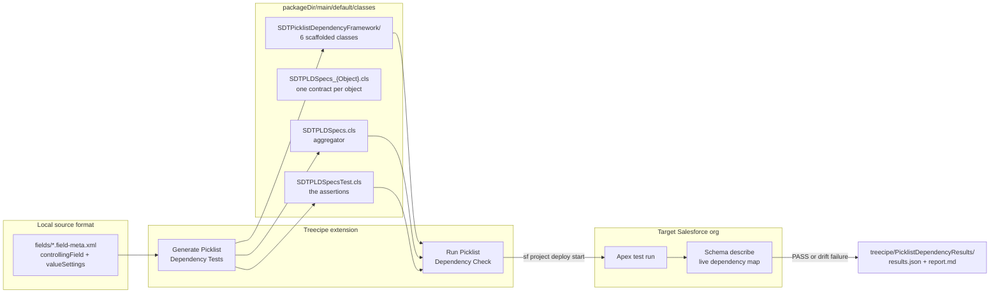
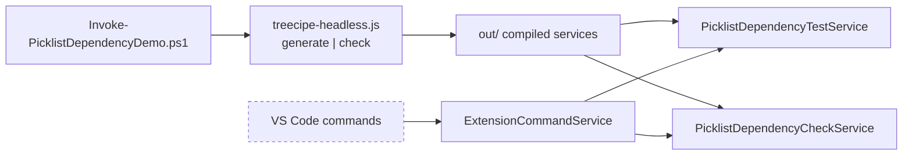
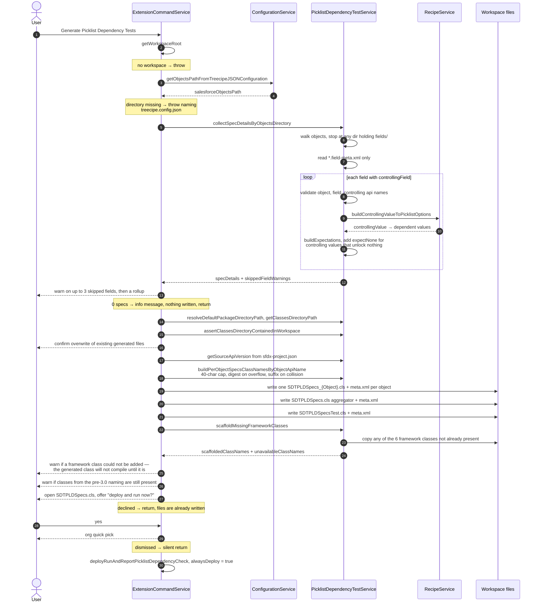
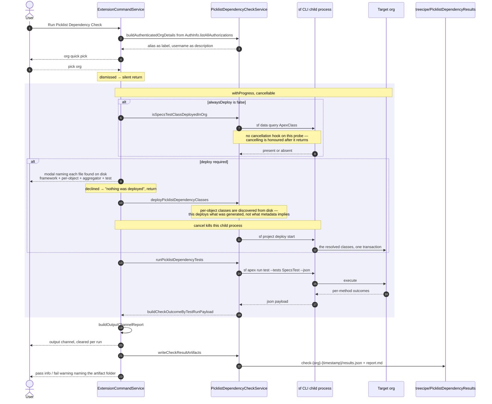
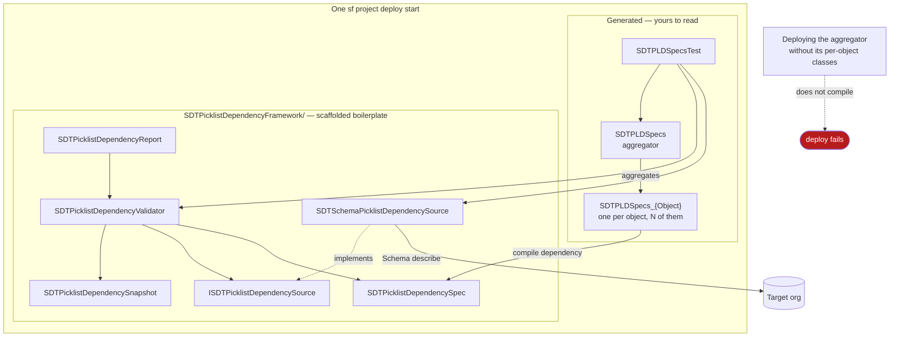
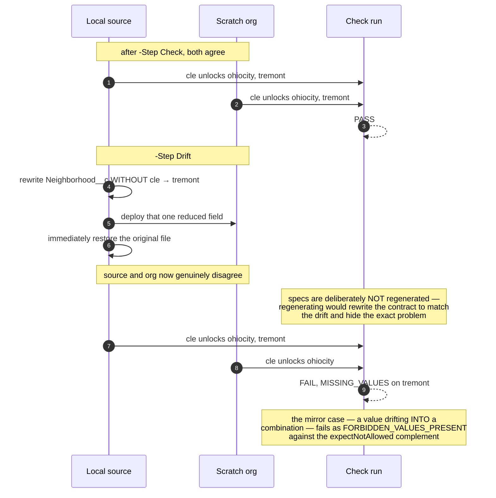

# Picklist Dependency Testing — Flow Diagrams

Visual companion to [`README.md`](./README.md). That file is the runbook — what to type and what to
expect. This file is the map — what actually moves, in what order, and where each step can stop.

Every diagram below is drawn from shipped code, not from intent:
`ExtensionCommandService`, `PicklistDependencyTestService`, `PicklistDependencyCheckService`,
and `Invoke-PicklistDependencyDemo.ps1`.

| Diagram | Answers |
|---|---|
| [1. The contract loop](#1-the-contract-loop) | What is the feature, in one picture |
| [2. Demo script step machine](#2-demo-script-step-machine) | What each `-Step` does and what gates it |
| [3. Generate command](#3-generate-picklist-dependency-tests) | What happens on generate, including every early exit |
| [4. Run check command](#4-run-picklist-dependency-check) | Deploy-or-skip, cancellation, artifacts |
| [5. The deployment set](#5-the-deployment-set) | Why the framework, the aggregator and every per-object class ship in one transaction |
| [6. Drift detection](#6-drift-detection-the-step-that-proves-it) | How a rewired org gets caught |
| [7. Metadata to assertion](#7-metadata-to-assertion) | XML → Apex → verdict, value by value |

---

## 1. The contract loop

Source metadata is the contract. The org is the thing under test. The generated Apex is the bridge.



The point of the loop: that map already existed inside Treecipe to drive recipe generation, and used
to die at YAML-write time. Turning it into Apex makes it executable, so an admin rewiring the
dependency later fails a test instead of surfacing as a confusing Collections API error at data load.

---

## 2. Demo script step machine

`./Invoke-PicklistDependencyDemo.ps1 -Step <Step>`. `All` runs `Preflight` → `Check`.
`Drift`, `Restore` and `Teardown` are opt-in because they mutate or destroy the org.


`Deploy` is not optional even though generation reads nothing from the org: the Apex test resolves
`Treecipe_Demo__c.Neighborhood__c` through Schema describe, so the fields must exist in the org or
every method fails with `LOOKUP_ERROR`.

The script drives the same compiled services the VS Code commands drive, through
`treecipe-headless.js` — the commands themselves cannot be invoked outside an extension host.



---

## 3. Generate Picklist Dependency Tests

`treecipe.generatePicklistDependencyTests` → `ExtensionCommandService.generatePicklistDependencyTests`.
Generation reads local source metadata — a `readDirectory` per directory and a `readFile` plus xml2js
parse per `*.field-meta.xml`, scaling with the size of the objects tree. It writes the Apex classes.
It never reads the org: org contact happens only if you accept the deploy prompt at the end.



That final call always deploys: the classes were just rewritten, so the org copy is stale by
definition and a conditional deploy would run yesterday's contract against today's metadata.

---

## 4. Run Picklist Dependency Check

`treecipe.runPicklistDependencyCheck`. Same shared helper as the tail of generate, with
`alwaysDeploy = false`.



The output channel is cleared on every invocation, so the artifact folder is what survives —
committable, diffable between runs, attachable to a review. Passing runs are written too: a green
check belongs on record, not just a failing one.

---

## 5. The deployment set

The framework, the aggregator, the test and one class per object — all in one transaction. Not a
convention, a compile requirement.



Salesforce resolves `ApexClass` by the enclosing `classes` directory and walks nested folders, so the
subdirectory deploys identically to a flat layout. The split is for humans: the framework is
replaceable boilerplate you can delete in one action; the generated files are the contract you
actually engage with. Workspaces generated by an earlier version keep the framework loose at the
classes root — both layouts work, and each class is resolved from one path only, since Salesforce
rejects the same `ApexClass` twice in one deployment.

The count is deliberately not stated as a number here. It is `6 + N + 2` — six framework classes, one
per object with a dependent picklist, plus the aggregator and its test — so it moves with the
metadata. `getPicklistDependencyClassFilePaths` discovers the per-object classes **from disk** rather
than re-deriving them from metadata, because this command deploys what was generated; re-deriving
would silently disagree with it whenever the metadata changed after the last generation.

Generated class names must also fit Salesforce's 40-character `ApexClass.Name` cap. An object api
name long enough to breach it is truncated and given a six-character digest of the *full* api name —
stable across runs, where a positional suffix would orphan the previously generated class in the org.

Upgrading from 2.12.x–2.14.x leaves the pre-3.0 classes (`SFTreecipePicklistDependencySpecs` and the
old `PicklistDependencyFramework/`) in the workspace. Generation warns about them rather than
deleting them, so you are told what to remove instead of ending up with two frameworks side by side.

---

## 6. Drift detection, the step that proves it

A check that only ever passes proves nothing.



The failure names the object, the field, the controlling value, and the specific missing value:

```
FAIL  Treecipe_Demo_c_picklistDependenciesMatchSourceMetadata
      System.AssertException: Assertion Failed: Picklist dependency drift on Treecipe_Demo__c
      -- 1 combination(s) no longer match local source metadata:
        - MISSING_VALUES — Treecipe_Demo__c.Neighborhood__c @ "cle": Expected values no longer valid: [tremont]
```

The method name is `Treecipe_Demo_c_...`, not `Treecipe_Demo__c_...`: Apex identifiers may not
contain two consecutive underscores, so runs of underscores in the object api name are collapsed by
`buildTestMethodNameByObjectApiName`. The api name itself reaches the assertion as a string literal
and keeps its exact `__c` suffix, so the describe still resolves the real object.

`MISSING_VALUES` is one of several kinds `SDTPicklistDependencyValidator.FailureKind` can report.
The others carry their own meaning: `FORBIDDEN_VALUES_PRESENT` for a value that drifted into a
combination it does not belong in, `UPSTREAM_FAILURE` for a link whose controlling field already
failed further up a chain, `CIRCULAR_DEPENDENCY`, `CONTROLLING_FIELD_MISMATCH`,
`UNKNOWN_CONTROLLING_VALUE`, `UNEXPECTED_VALUES`, and `LOOKUP_ERROR` when a field cannot be resolved
at all — that last one is reported per spec rather than aborting, so the remaining specs still run.

---

## 7. Metadata to assertion

One dependent field, end to end.


Every combination is now asserted twice. `expectAtLeast` says which values a controlling value must
still unlock; `expectNotAllowed` says which it must not. The pair catches a value going missing *and*
a value drifting into the wrong bucket — the positive assertion alone only ever caught the first.

The complement is deliberately not `expectExactly`. Switching the generator to an exact match would
be the obvious move and is wrong: it fires on any value an admin legitimately adds to the field after
generation. The complement tolerates that while still failing on a value in the wrong bucket. Its
universe comes from the field's own declared values rather than its `valueSettings` map, so a value
with no `valueSettings` entry at all — unreachable under every controlling value — falls into every
complement naturally. A controlling value that unlocks nothing gets no complement: `expectNone`
already asserts that.

A chained dependency (`Country__c` → `State__c` → `City__c`) emits `dependsOn` naming the upstream
spec's own generated method, so a break upstream is reported once at its source and each link below
it gets a single `UPSTREAM_FAILURE` instead of repeating the same describe mismatch all the way down.

A field with a `controllingField` but no `valueSettings` markup is reported and skipped rather than
aborting the run, as is a field whose object, field, or controlling api name is not a plain
Salesforce identifier.

---

## What the diagrams cannot cover

The VS Code UI layer has no automated coverage **beyond unit tests against a mocked `vscode`** —
`ExtensionCommandService.test.ts` does cover the command paths, including cancellation, the empty-org
case and report display, but against a mock rather than a running extension host, and the demo script
drives the compiled services rather than the host either. What no automated test observes is the real
UI: that the quick pick shows alias and username as it should, that the progress notification actually
renders a Cancel button, that the deploy modal is modal, and that the output channel opens and indents
multi-line assertion messages. The manual checklist in
[`README.md`](./README.md#testing-through-the-vs-code-ui-instead) is what covers those.
