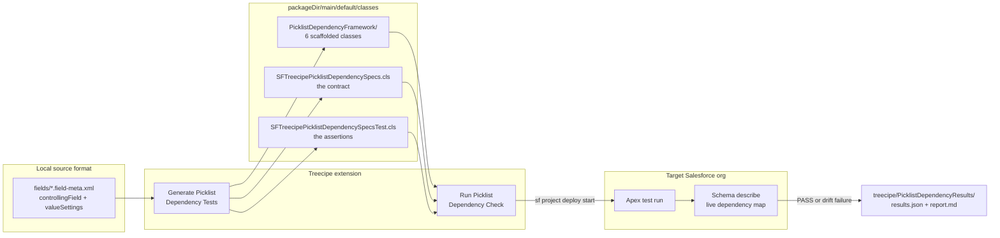
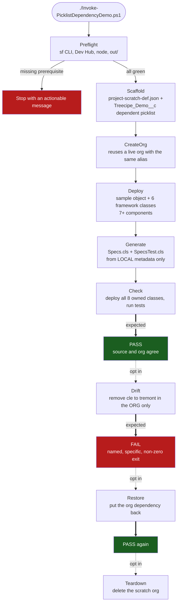
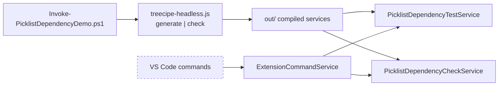
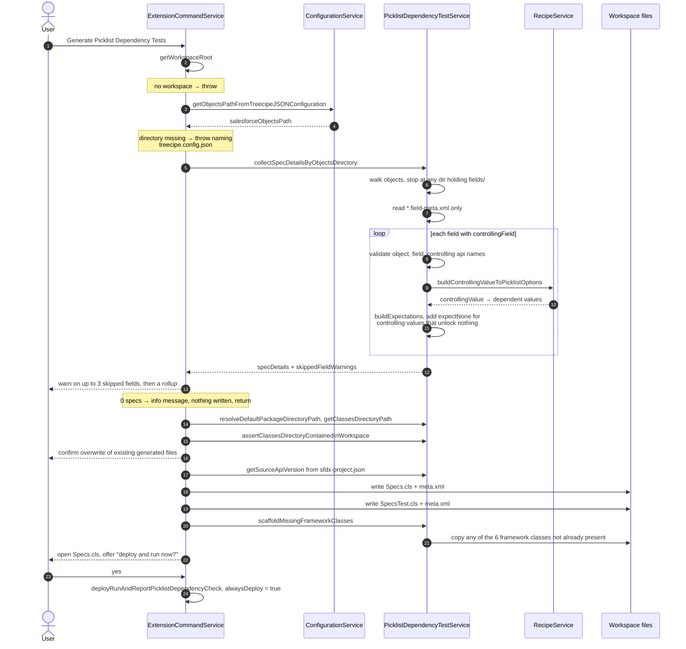
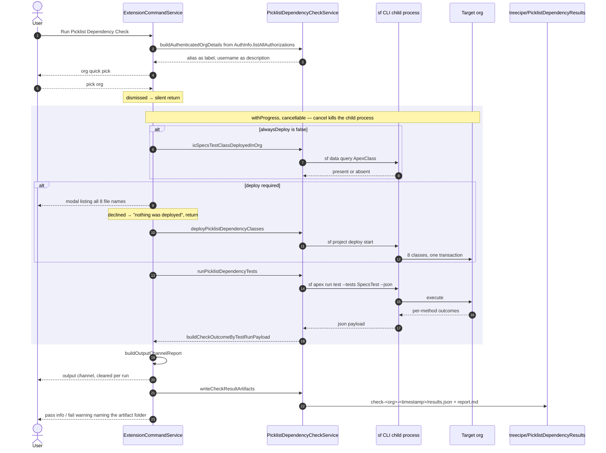
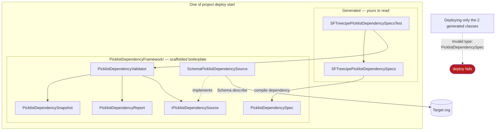
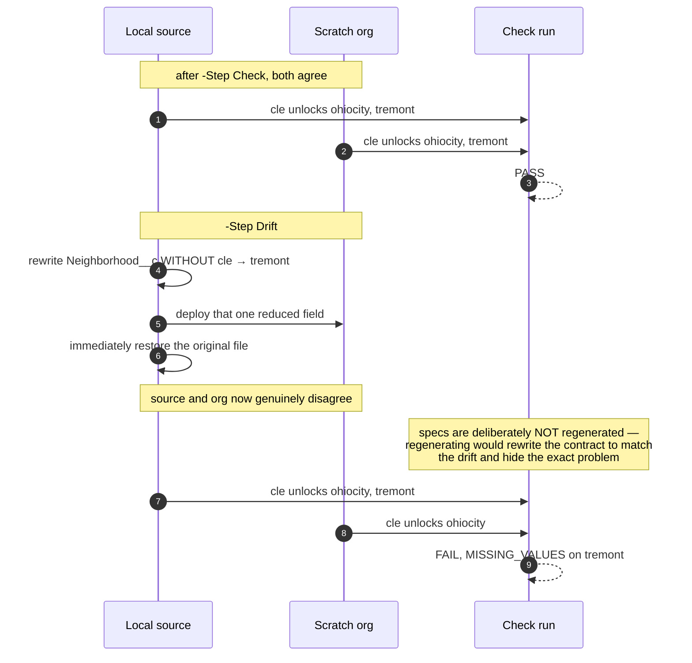
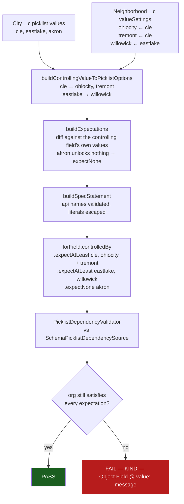

# Picklist Dependency Testing — Flow Diagrams

Visual companion to [`README.md`](./README.md). That file is the runbook — what to type and what to
expect. This file is the map — what actually moves, in what order, and where each step can stop.

Every diagram below is drawn from shipped code, not from intent:
`ExtensionCommandService`, `PicklistDependencyTestService`, `PicklistDependencyCheckService`,
and `Invoke-PicklistDependencyDemo.ps1`.

| Diagram | Answers |
|---|---|
| [1. The contract loop](#1-the-contract-loop) | What is the feature, in one picture |
| [2. Demo script step machine](#2-demo-script-step-machine) | What each `-Step` does and what gates it |
| [3. Generate command](#3-generate-picklist-dependency-tests) | What happens on generate, including every early exit |
| [4. Run check command](#4-run-picklist-dependency-check) | Deploy-or-skip, cancellation, artifacts |
| [5. The deployment set](#5-the-deployment-set) | Why all eight classes ship in one transaction |
| [6. Drift detection](#6-drift-detection-the-step-that-proves-it) | How a rewired org gets caught |
| [7. Metadata to assertion](#7-metadata-to-assertion) | XML → Apex → verdict, value by value |

---

## 1. The contract loop

Source metadata is the contract. The org is the thing under test. The generated Apex is the bridge.



The point of the loop: that map already existed inside Treecipe to drive recipe generation, and used
to die at YAML-write time. Turning it into Apex makes it executable, so an admin rewiring the
dependency later fails a test instead of surfacing as a confusing Collections API error at data load.

---

## 2. Demo script step machine

`./Invoke-PicklistDependencyDemo.ps1 -Step <Step>`. `All` runs `Preflight` → `Check`.
`Drift`, `Restore` and `Teardown` are opt-in because they mutate or destroy the org.



`Deploy` is not optional even though generation reads nothing from the org: the Apex test resolves
`Treecipe_Demo__c.Neighborhood__c` through Schema describe, so the fields must exist in the org or
every method fails with `LOOKUP_ERROR`.

The script drives the same compiled services the VS Code commands drive, through
`treecipe-headless.js` — the commands themselves cannot be invoked outside an extension host.



---

## 3. Generate Picklist Dependency Tests

`treecipe.generatePicklistDependencyTests` → `ExtensionCommandService.generatePicklistDependencyTests`.
Generation only writes files. It never reads the org.



Step 27 always deploys: the classes were just rewritten, so the org copy is stale by definition and a
conditional deploy would run yesterday's contract against today's metadata.

---

## 4. Run Picklist Dependency Check

`treecipe.runPicklistDependencyCheck`. Same shared helper as the tail of generate, with
`alwaysDeploy = false`.



The output channel is cleared on every invocation, so the artifact folder is what survives —
committable, diffable between runs, attachable to a review. Passing runs are written too: a green
check belongs on record, not just a failing one.

---

## 5. The deployment set

Eight classes, one transaction. Not a convention — a compile requirement.



Salesforce resolves `ApexClass` by the enclosing `classes` directory and walks nested folders, so the
subdirectory deploys identically to a flat layout. The split is for humans: the framework is
replaceable boilerplate you can delete in one action; the two generated files are the contract you
actually engage with. Workspaces generated by an earlier version keep the framework loose at the
classes root — both layouts work, and each class is resolved from one path only, since Salesforce
rejects the same `ApexClass` twice in one deployment.

---

## 6. Drift detection, the step that proves it

A check that only ever passes proves nothing.



The failure names the object, the field, the controlling value, and the specific missing value:

```
FAIL  Treecipe_Demo_c_picklistDependenciesMatchSourceMetadata
      System.AssertException: Assertion Failed: Picklist dependency drift on Treecipe_Demo__c
      -- 1 combination(s) no longer match local source metadata:
        - MISSING_VALUES — Treecipe_Demo__c.Neighborhood__c @ "cle": Expected values no longer valid: [tremont]
```

The method name is `Treecipe_Demo_c_...`, not `Treecipe_Demo__c_...`: Apex identifiers may not
contain two consecutive underscores, so runs of underscores in the object api name are collapsed by
`buildTestMethodNameByObjectApiName`. The api name itself reaches the assertion as a string literal
and keeps its exact `__c` suffix, so the describe still resolves the real object.

---

## 7. Metadata to assertion

One dependent field, end to end.



`expectAtLeast` is what the generator always emits: combinations present in source must still exist,
while values the org has *added* since are tolerated. Tightening a line to `expectExactly` is a
deliberate hand edit — and is lost on regeneration, which the generated file header states plainly.

A field with a `controllingField` but no `valueSettings` markup is reported and skipped rather than
aborting the run, as is a field whose object, field, or controlling api name is not a plain
Salesforce identifier.

---

## What the diagrams cannot cover

The VS Code UI layer has no automated coverage — Jest mocks `vscode`, and the demo script drives the
compiled services rather than the extension host. The manual checklist in
[`README.md`](./README.md#testing-through-the-vs-code-ui-instead) is the only thing exercising the
quick pick, the cancellable progress notification, the deploy modal, and the output channel.
