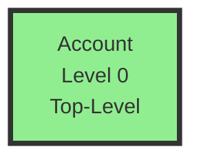
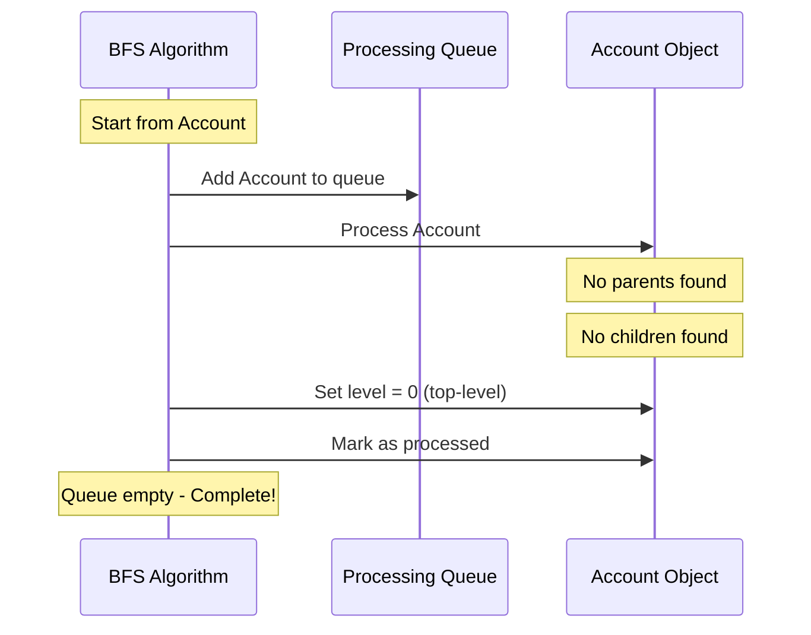

# Test Scenario 1: Single Isolated Object

**Test:** INPUT: Single isolated object → OUTPUT: Found 1 object at level 0

## Relationship Structure

## BFS Processing Flow

## Processing Steps

1. **Initialize**: Start BFS from 'Account'
2. **Queue**: [Account]
3. **Process Account**:
   - Check parent references: {} (empty)
   - Check child references: {} (empty)
   - No parents → Top-level object
   - Assign level: 0
   - Mark as processed
4. **Result**: 1 object at level 0

## Legend
- **Green boxes with thick border**: Top-level objects (Level 0)
- **Parent → Child**: Arrow direction shows dependency

## Expected Results
- **Total Objects**: 1
- **Top-Level Objects**: 1 (Account)
- **Max Level**: 0
- **All Objects**: [Account]

## Description
A single isolated object with no relationships. Account has no parent or child references, making it a top-level object at level 0. The BFS algorithm processes it once, finds no connections, and assigns it to level 0.
