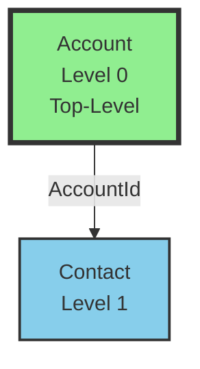
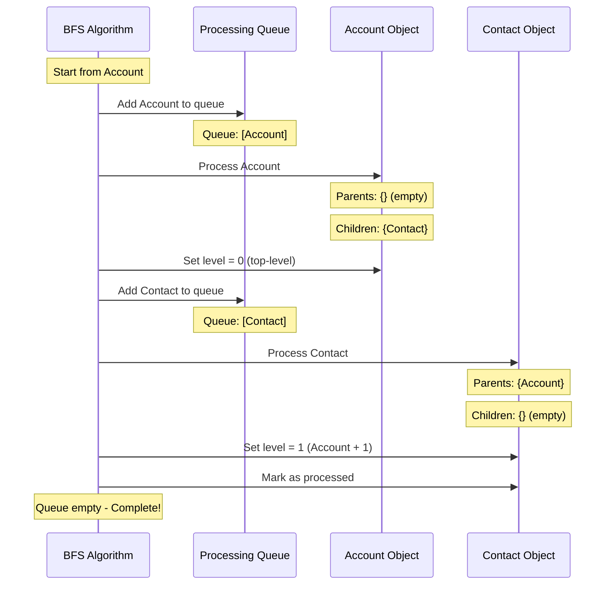

# Test Scenario 2: Simple Parent-Child Chain

**Test:** INPUT: A→B chain, start at A → OUTPUT: Found [A, B] with A at level 0, B at level 1

## Relationship Structure

## BFS Processing Flow

## Processing Steps

1. **Initialize**: Start BFS from 'Account'
2. **Queue**: [Account]
3. **Process Account** (Wave 1):
   - Check parent references: {} (empty)
   - Check child references: {Contact: ['AccountId']}
   - No parents → Top-level object
   - Assign level: 0
   - Add Contact to queue
   - Mark as processed
4. **Queue**: [Contact]
5. **Process Contact** (Wave 2):
   - Check parent references: {Account: ['AccountId']}
   - Check child references: {} (empty)
   - Has parent Account at level 0
   - Assign level: 1 (parent level + 1)
   - Mark as processed
6. **Result**: 2 objects, max level 1

## Legend
- **Green boxes with thick border**: Top-level objects (Level 0)
- **Blue boxes**: Child objects at Level 1
- **Parent → Child**: Arrow shows parent-to-child relationship with field name

## Expected Results
- **Total Objects**: 2
- **Top-Level Objects**: 1 (Account)
- **Max Level**: 1
- **All Objects**: [Account, Contact]

## Hierarchy
- **Level 0**: Account
- **Level 1**: Contact (child of Account via AccountId)

## Description
Simple two-object hierarchy where Account is the parent and Contact is the child. The BFS algorithm first processes Account (level 0), discovers Contact as a child, adds it to the queue, then processes Contact and assigns it to level 1 (parent level + 1).
