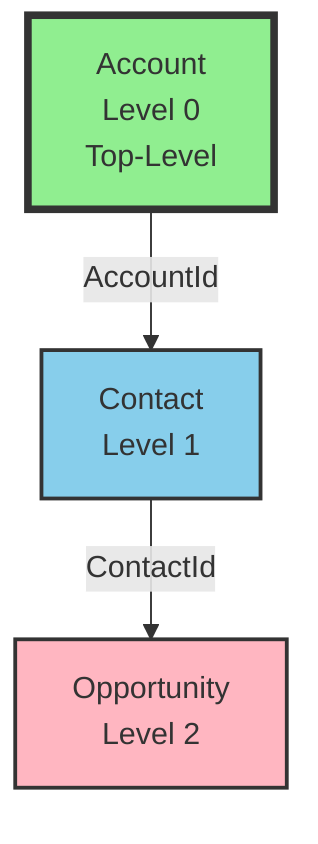
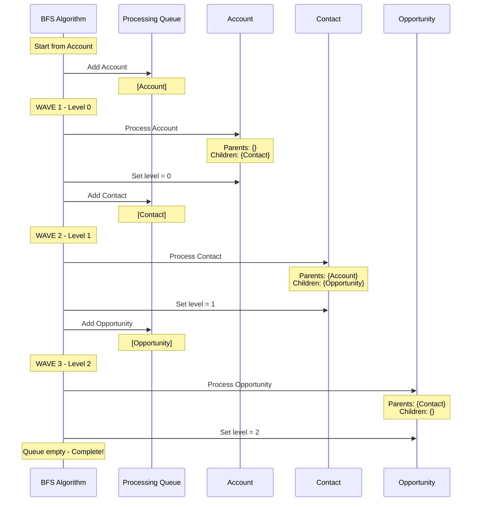

# Test Scenario 3: Linear Three-Level Chain

**Test:** INPUT: A→B→C chain, start at A → OUTPUT: Found [A, B, C] at levels 0, 1, 2

## Relationship Structure

## BFS Processing Flow

## Processing Steps

1. **Initialize**: Start BFS from 'Account'
2. **Wave 1 - Process Account**:
   - Queue: [Account]
   - Parent references: {} (empty)
   - Child references: {Contact: ['AccountId']}
   - No parents → Top-level object
   - Assign level: 0
   - Add Contact to queue
3. **Wave 2 - Process Contact**:
   - Queue: [Contact]
   - Parent references: {Account: ['AccountId']}
   - Child references: {Opportunity: ['ContactId']}
   - Has parent Account at level 0
   - Assign level: 1 (parent + 1)
   - Add Opportunity to queue
4. **Wave 3 - Process Opportunity**:
   - Queue: [Opportunity]
   - Parent references: {Contact: ['ContactId']}
   - Child references: {} (empty)
   - Has parent Contact at level 1
   - Assign level: 2 (parent + 1)
5. **Result**: 3 objects, max level 2

## Legend
- **Green boxes with thick border**: Top-level objects (Level 0)
- **Blue boxes**: Objects at Level 1
- **Pink boxes**: Objects at Level 2
- **Parent → Child**: Arrow shows parent-to-child relationship with field name

## Expected Results
- **Total Objects**: 3
- **Top-Level Objects**: 1 (Account)
- **Max Level**: 2
- **All Objects**: [Account, Contact, Opportunity]

## Hierarchy
- **Level 0**: Account
- **Level 1**: Contact (child of Account)
- **Level 2**: Opportunity (child of Contact)

## Description
Linear three-level hierarchy demonstrating BFS depth traversal. The algorithm processes each level sequentially: Wave 1 processes Account (level 0), Wave 2 processes Contact (level 1), and Wave 3 processes Opportunity (level 2). Each object is placed one level deeper than its parent.
