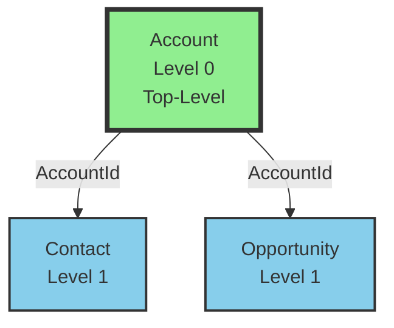
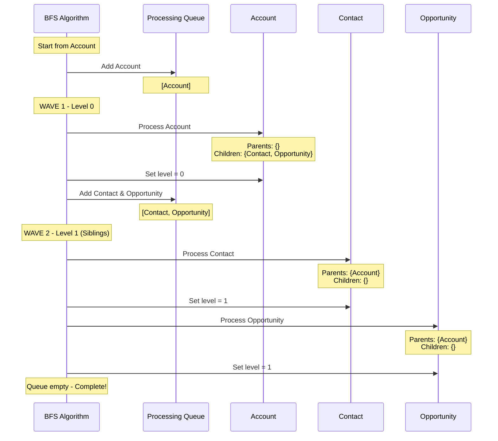

# Test Scenario 4: Parent with Two Children

**Test:** INPUT: A with two children B and C, start at A → OUTPUT: Found [A, B, C] with B and C both at level 1

## Relationship Structure

## BFS Processing Flow

## Processing Steps

1. **Initialize**: Start BFS from 'Account'
2. **Wave 1 - Process Account**:
   - Queue: [Account]
   - Parent references: {} (empty)
   - Child references: {Contact: ['AccountId'], Opportunity: ['AccountId']}
   - No parents → Top-level object
   - Assign level: 0
   - Add both Contact and Opportunity to queue
3. **Wave 2 - Process Siblings** (same level):
   - Queue: [Contact, Opportunity]
   - **Process Contact**:
     - Parent references: {Account: ['AccountId']}
     - Child references: {} (empty)
     - Has parent Account at level 0
     - Assign level: 1 (parent + 1)
   - **Process Opportunity**:
     - Parent references: {Account: ['AccountId']}
     - Child references: {} (empty)
     - Has parent Account at level 0
     - Assign level: 1 (parent + 1)
4. **Result**: 3 objects, max level 1

## Legend
- **Green boxes with thick border**: Top-level objects (Level 0)
- **Blue boxes**: Objects at Level 1
- **Parent → Child**: Arrow shows parent-to-child relationship with field name

## Expected Results
- **Total Objects**: 3
- **Top-Level Objects**: 1 (Account)
- **Max Level**: 1
- **All Objects**: [Account, Contact, Opportunity]

## Hierarchy
- **Level 0**: Account
- **Level 1**: Contact, Opportunity (both children of Account, processed in same BFS wave)

## Description
Demonstrates BFS behavior where siblings are at the same level. Account has two children (Contact and Opportunity), and both are added to the queue during Wave 1. In Wave 2, both siblings are processed and assigned to level 1 since they share the same parent at level 0. This shows the "breadth-first" nature - all objects at the same distance from the root are processed together.
