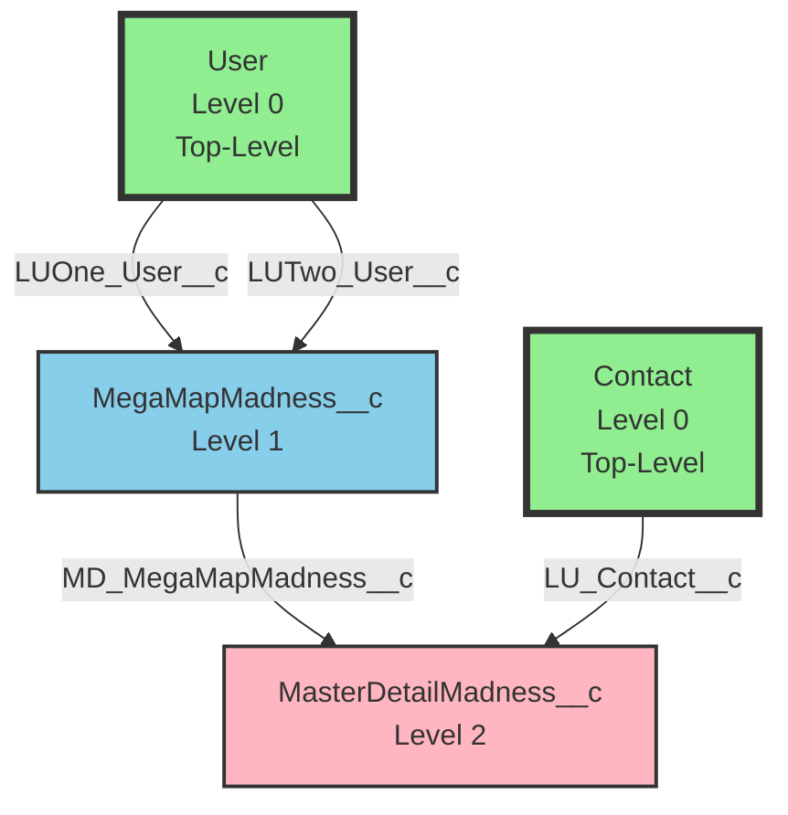
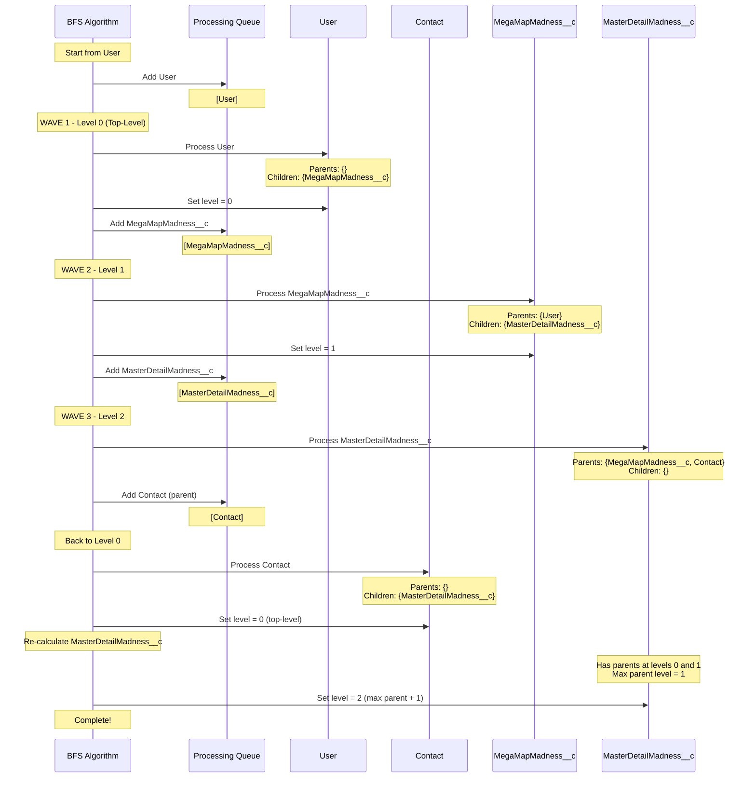

# Test Scenario 5: Complex Multi-Parent Hierarchy

**Test:** Complex User→MegaMapMadness→MasterDetailMadness scenario

## Relationship Structure

## Legend
- **Green boxes with thick border**: Top-level objects (Level 0)
- **Blue boxes**: Objects at Level 1
- **Pink boxes**: Objects at Level 2
- **Parent → Child**: Arrow shows parent-to-child relationship with field name

## Expected Results
- **Total Objects**: 4
- **Top-Level Objects**: 2 (User, Contact)
- **Max Level**: 2
- **All Objects**: [User, MegaMapMadness__c, MasterDetailMadness__c, Contact]

## Hierarchy
- **Level 0**: User, Contact (both have no parents in this tree)
- **Level 1**: MegaMapMadness__c (child of User via two lookup fields)
- **Level 2**: MasterDetailMadness__c (child of both MegaMapMadness__c and Contact)

## BFS Processing Flow

## Processing Steps

1. **Initialize**: Start BFS from 'User'
2. **Wave 1 - Process User**:
   - Queue: [User]
   - Parent references: {} (empty)
   - Child references: {MegaMapMadness__c: ['LUOne_User__c', 'LUTwo_User__c']}
   - No parents → Top-level object
   - Assign level: 0
   - Add MegaMapMadness__c to queue
3. **Wave 2 - Process MegaMapMadness__c**:
   - Queue: [MegaMapMadness__c]
   - Parent references: {User: ['LUOne_User__c', 'LUTwo_User__c']}
   - Child references: {MasterDetailMadness__c: ['MD_MegaMapMadness__c']}
   - Has parent User at level 0
   - Assign level: 1
   - Add MasterDetailMadness__c to queue
4. **Wave 3 - Process MasterDetailMadness__c**:
   - Queue: [MasterDetailMadness__c]
   - Parent references: {MegaMapMadness__c: ['MD_MegaMapMadness__c'], Contact: ['LU_Contact__c']}
   - Child references: {} (empty)
   - Discover Contact as parent (not processed yet)
   - Add Contact to queue for processing
5. **Process Contact** (discovered as parent):
   - Queue: [Contact]
   - Parent references: {} (empty)
   - Child references: {MasterDetailMadness__c: ['LU_Contact__c']}
   - No parents → Top-level object
   - Assign level: 0
6. **Re-calculate MasterDetailMadness__c level**:
   - Parents: MegaMapMadness__c (level 1), Contact (level 0)
   - Max parent level: 1
   - Assign level: 2 (max parent + 1)
7. **Result**: 4 objects, 2 top-level, max level 2

## Description
Complex scenario with two separate top-level parents (User and Contact) that converge at MasterDetailMadness__c. The BFS algorithm discovers both hierarchies: User → MegaMapMadness__c → MasterDetailMadness__c and Contact → MasterDetailMadness__c. When processing MasterDetailMadness__c, it discovers Contact as an unprocessed parent, adds it to the queue, and identifies it as a second top-level object. MasterDetailMadness__c is placed at level 2 since its deepest parent (MegaMapMadness__c) is at level 1.
