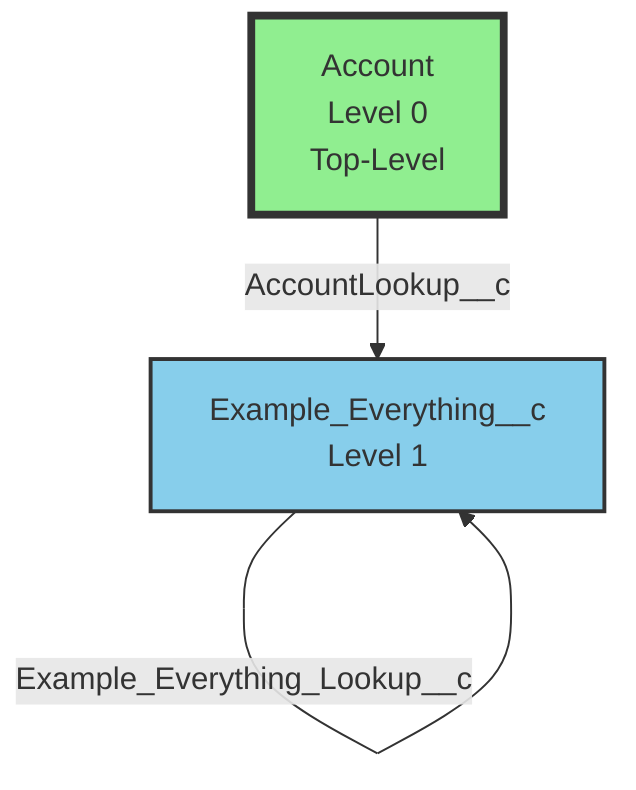
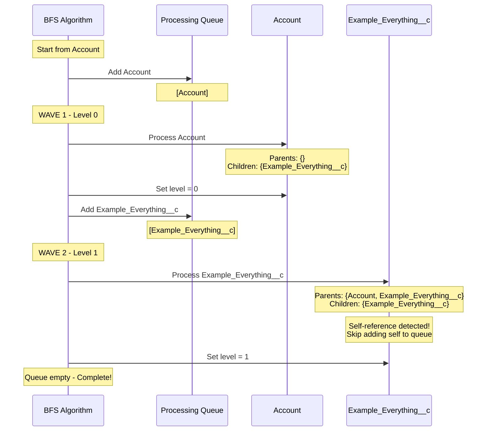

# Test Scenario 6: Self-Referencing Object

**Test:** Complex Example_Everything__c scenario with self-reference

## Relationship Structure

## Legend
- **Green boxes with thick border**: Top-level objects (Level 0)
- **Blue boxes**: Objects at Level 1
- **Curved arrow to self**: Self-referencing relationship
- **Parent → Child**: Arrow shows parent-to-child relationship with field name

## Expected Results
- **Total Objects**: 2
- **Top-Level Objects**: 1 (Account)
- **Max Level**: 1
- **All Objects**: [Account, Example_Everything__c]

## Hierarchy
- **Level 0**: Account
- **Level 1**: Example_Everything__c (child of Account, with self-reference)

## BFS Processing Flow

## Processing Steps

1. **Initialize**: Start BFS from 'Account'
2. **Wave 1 - Process Account**:
   - Queue: [Account]
   - Parent references: {} (empty)
   - Child references: {Example_Everything__c: ['AccountLookup__c']}
   - No parents → Top-level object
   - Assign level: 0
   - Add Example_Everything__c to queue
3. **Wave 2 - Process Example_Everything__c**:
   - Queue: [Example_Everything__c]
   - Parent references: {Account: ['AccountLookup__c'], Example_Everything__c: ['Example_Everything_Lookup__c']}
   - Child references: {Example_Everything__c: ['Example_Everything_Lookup__c']}
   - **Detect self-reference**: Example_Everything__c references itself
   - Has external parent Account at level 0
   - Assign level: 1 (parent + 1)
   - Skip adding self to queue (already processed/processing)
4. **Result**: 2 objects, max level 1

## Self-Reference Handling

The algorithm detects the circular reference when it sees `Example_Everything__c` in both parent and child references pointing to itself. The key points:
- Self-references are identified and skipped during queue population
- Level calculation uses only external parents (Account), not self-references
- The object is marked as processed to prevent infinite loops

## Description
Demonstrates handling of self-referencing objects. Example_Everything__c has a lookup to Account (making it level 1) and also has a self-referencing lookup field. The algorithm correctly handles the circular reference by detecting when an object references itself, skipping the self-add to queue, and calculating level based only on external parents. The self-reference doesn't affect the level calculation.
