# Test Scenario 7: Diamond Pattern with Multiple Top-Level Parents

**Test:** Complex Product-Order-OrderItem hierarchy scenario

## Relationship Structure

## Legend
- **Green boxes with thick border**: Top-level objects (Level 0)
- **Blue boxes**: Objects at Level 1
- **Pink boxes**: Objects at Level 2
- **Parent → Child**: Arrow shows parent-to-child relationship with field name

## Expected Results
- **Total Objects**: 5
- **Top-Level Objects**: 2 (Product_Family__c, Account)
- **Max Level**: 2
- **All Objects**: [Product_Family__c, Account, Product__c, Order__c, Order_Item__c]

## Hierarchy
- **Level 0**: Product_Family__c, Account (both have no parents)
- **Level 1**: Product__c (child of Product_Family__c), Order__c (child of Account)
- **Level 2**: Order_Item__c (child of BOTH Product__c and Order__c)

## BFS Processing Flow

```mermaid
sequenceDiagram
    participant BFS as BFS Algorithm
    participant Queue as Processing Queue
    participant PF as Product_Family__c
    participant Acct as Account
    participant Prod as Product__c
    participant Order as Order__c
    participant Item as Order_Item__c
    
    Note over BFS: Start from Product_Family__c
    BFS->>Queue: Add Product_Family__c
    Note over Queue: [Product_Family__c]
    
    Note over BFS: WAVE 1 - Level 0 (First Top-Level)
    BFS->>PF: Process Product_Family__c
    Note over PF: Parents: {}<br/>Children: {Product__c}
    BFS->>PF: Set level = 0
    BFS->>Queue: Add Product__c
    Note over Queue: [Product__c]
    
    Note over BFS: WAVE 2 - Level 1 (First Branch)
    BFS->>Prod: Process Product__c
    Note over Prod: Parents: {Product_Family__c}<br/>Children: {Order_Item__c}
    BFS->>Prod: Set level = 1
    BFS->>Queue: Add Order_Item__c
    Note over Queue: [Order_Item__c]
    
    Note over BFS: WAVE 3 - Level 2 (Converging Point)
    BFS->>Item: Process Order_Item__c
    Note over Item: Parents: {Product__c, Order__c}<br/>Children: {}
    BFS->>Queue: Add Order__c (parent)
    Note over Queue: [Order__c]
    
    Note over BFS: Process Order__c
    BFS->>Order: Process Order__c
    Note over Order: Parents: {Account}<br/>Children: {Order_Item__c}
    BFS->>Order: Set level = 1
    BFS->>Queue: Add Account (parent)
    Note over Queue: [Account]
    
    Note over BFS: Back to Level 0 (Second Top-Level)
    BFS->>Acct: Process Account
    Note over Acct: Parents: {}<br/>Children: {Order__c}
    BFS->>Acct: Set level = 0 (top-level)
    
    Note over BFS: Re-calculate Order_Item__c
    Note over Item: Parents at levels:<br/>Product__c (1), Order__c (1)<br/>Max parent level = 1
    BFS->>Item: Set level = 2 (max parent + 1)
    
    Note over BFS: Complete!
```

## Processing Steps

1. **Initialize**: Start BFS from 'Product_Family__c'
2. **Wave 1 - Process Product_Family__c**:
   - Queue: [Product_Family__c]
   - Parent references: {} (empty)
   - Child references: {Product__c: ['Product_Family__c']}
   - No parents → Top-level object
   - Assign level: 0
   - Add Product__c to queue
3. **Wave 2 - Process Product__c**:
   - Queue: [Product__c]
   - Parent references: {Product_Family__c: ['Product_Family__c']}
   - Child references: {Order_Item__c: ['Product__c']}
   - Has parent Product_Family__c at level 0
   - Assign level: 1
   - Add Order_Item__c to queue
4. **Wave 3 - Process Order_Item__c**:
   - Queue: [Order_Item__c]
   - Parent references: {Product__c: ['Product__c'], Order__c: ['Order__c']}
   - Child references: {} (empty)
   - Discover Order__c as unprocessed parent
   - Add Order__c to queue
5. **Process Order__c** (second branch):
   - Queue: [Order__c]
   - Parent references: {Account: ['Account__c']}
   - Child references: {Order_Item__c: ['Order__c']}
   - Discover Account as unprocessed parent
   - Assign level: 1
   - Add Account to queue
6. **Process Account** (second top-level):
   - Queue: [Account]
   - Parent references: {} (empty)
   - Child references: {Order__c: ['Account__c']}
   - No parents → Top-level object
   - Assign level: 0
7. **Re-calculate Order_Item__c level**:
   - Parents: Product__c (level 1), Order__c (level 1)
   - Max parent level: 1
   - Assign level: 2 (max parent + 1)
8. **Result**: 5 objects, 2 top-level, max level 2

## Diamond Pattern Analysis

This diamond pattern demonstrates key BFS behaviors:
- **Bidirectional Discovery**: Starting from Product_Family__c, the algorithm discovers the entire connected graph by following both parent and child references
- **Multiple Top-Level Detection**: Account is discovered later as a second top-level object when processing Order__c
- **Multi-Parent Level Calculation**: Order_Item__c has two parents at the same level, so it's placed at level 2 (max parent level + 1)
- **Connected Component**: All 5 objects form a single connected component through their relationships

## Description
Classic diamond pattern where two separate hierarchies converge at a common child. The BFS algorithm starts from Product_Family__c and discovers the entire connected graph. It identifies both Product_Family__c and Account as top-level objects (no parents). Order_Item__c has two parents (Product__c and Order__c), both at level 1, so it's placed at level 2 using the formula: level = max(parent_levels) + 1. This demonstrates how BFS handles complex multi-parent scenarios.
